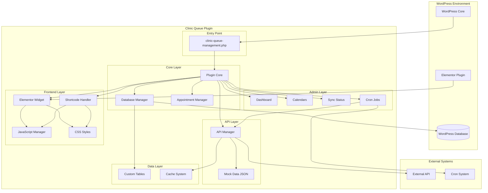
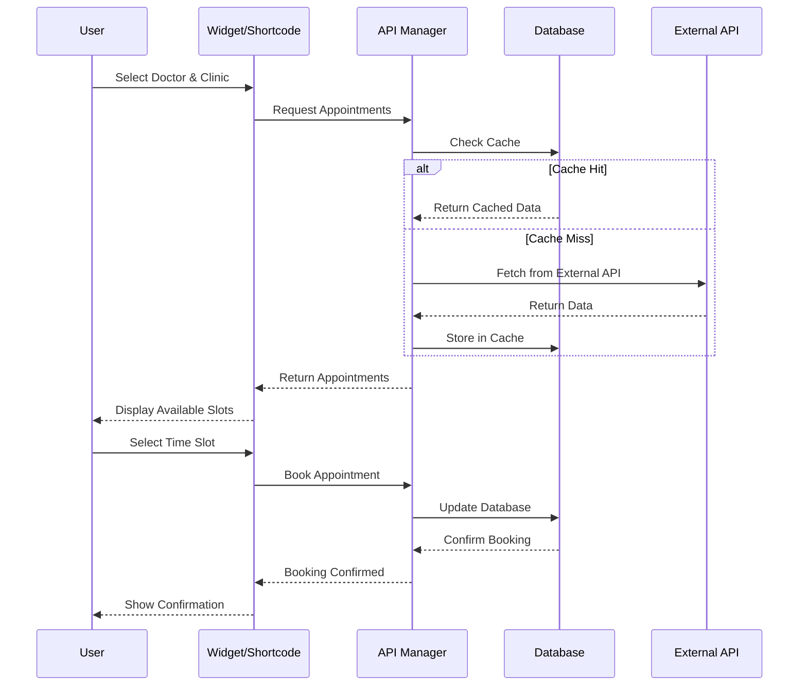
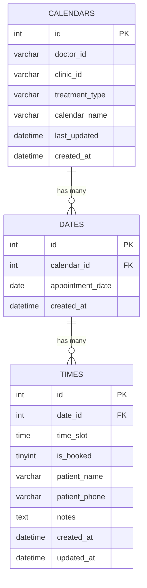
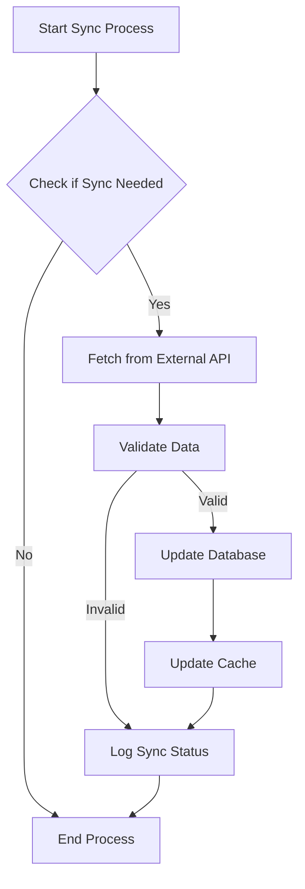
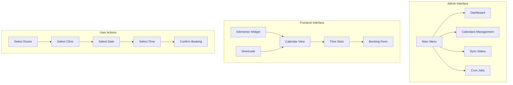
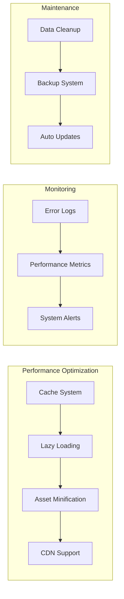

# תרשים ארכיטקטורה - מערכת ניהול תורים למרפאות

## תרשים כללי של המערכת

## תרשים זרימת נתונים

## תרשים מבנה בסיס הנתונים

## תרשים זרימת סנכרון

## תרשים ממשק משתמש

## תרשים ביצועים ואופטימיזציה

## מסקנות מהתרשימים

1. **ארכיטקטורה מודולרית** - המערכת בנויה בשכבות ברורות עם הפרדת אחריות
2. **זרימת נתונים יעילה** - Cache system מונע קריאות מיותרות ל-API
3. **ממשק משתמש אינטואיטיבי** - זרימה לוגית מהבחירה עד להזמנה
4. **ניטור וביצועים** - מערכת מעקב אחר ביצועים ותחזוקה
5. **גמישות** - תמיכה ב-Elementor ו-Shortcode
6. **אבטחה** - בדיקות הרשאות וסניטיזציה בכל שכבה
