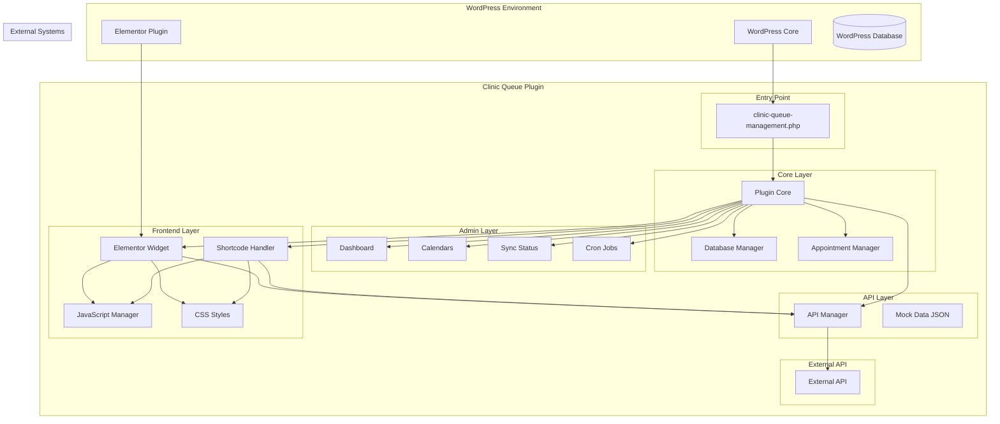
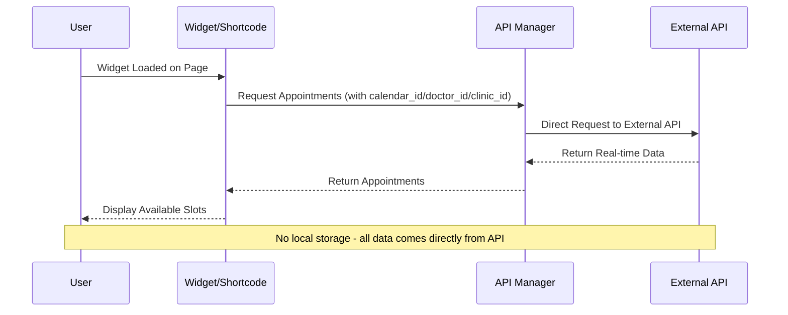
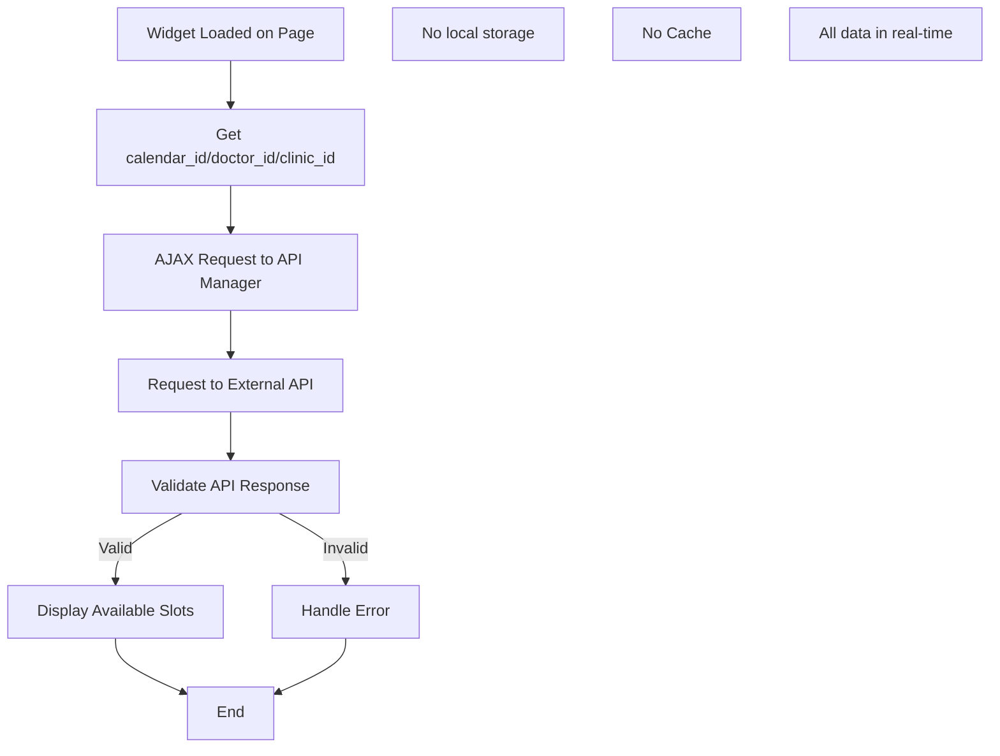
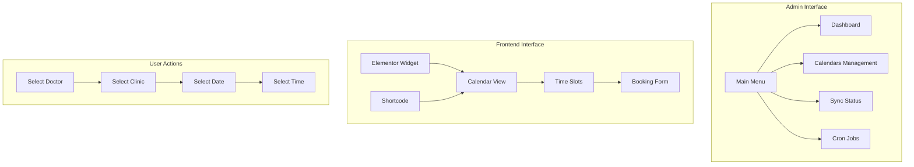
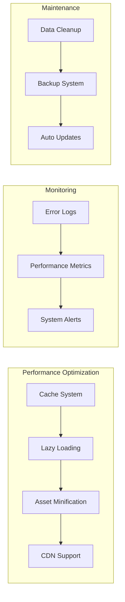

# תרשים ארכיטקטורה - מערכת הצגת שעות זמינות למרפאות

## תרשים כללי של המערכת



## תרשים זרימת נתונים



## תרשים מבנה נתונים (API Response)

```mermaid
erDiagram
    API_RESPONSE {
        string calendar_id
        string doctor_id
        string clinic_id
    }
    
    AVAILABLE_SLOTS {
        date date
        array time_slots
    }
    
    TIME_SLOT {
        string time
        boolean available
    }
    
    API_RESPONSE ||--o{ AVAILABLE_SLOTS : "contains"
    AVAILABLE_SLOTS ||--o{ TIME_SLOT : "contains"
    
    Note1[No local database]
    Note2[All data from API]
```

## תרשים זרימת קבלת תורים (זרימה חדשה)



## תרשים ממשק משתמש



## תרשים ביצועים ואופטימיזציה



## מסקנות מהתרשימים

1. **ארכיטקטורה מודולרית** - המערכת בנויה בשכבות ברורות עם הפרדת אחריות
2. **זרימת נתונים יעילה** - Cache system מונע קריאות מיותרות ל-API
3. **ממשק משתמש אינטואיטיבי** - זרימה לוגית מהבחירה עד להזמנה
4. **ניטור וביצועים** - מערכת מעקב אחר ביצועים ותחזוקה
5. **גמישות** - תמיכה ב-Elementor ו-Shortcode
6. **אבטחה** - בדיקות הרשאות וסניטיזציה בכל שכבה
