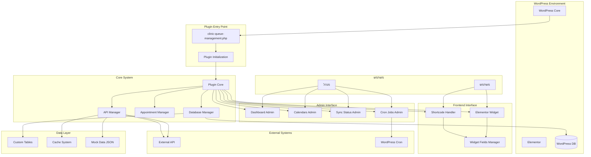
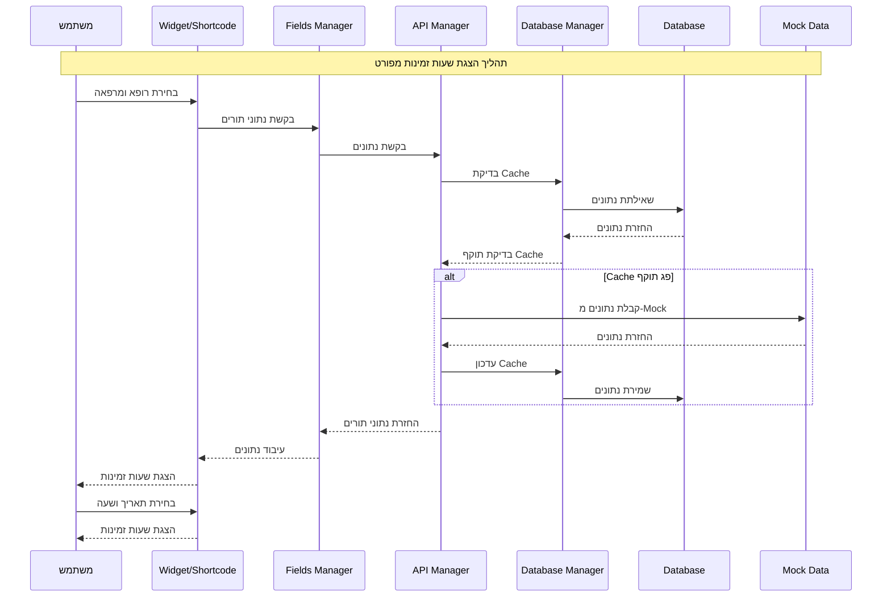
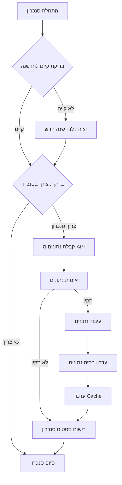
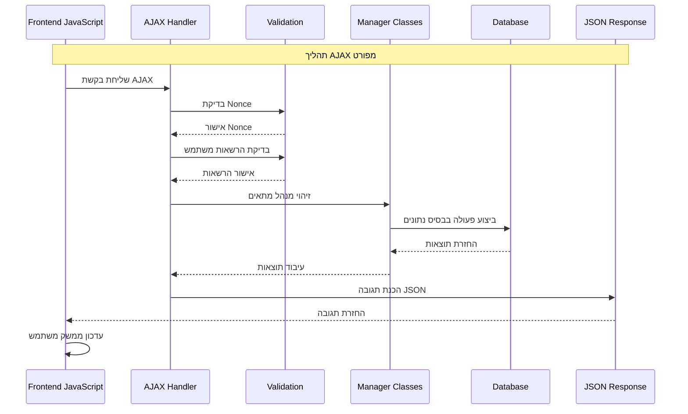
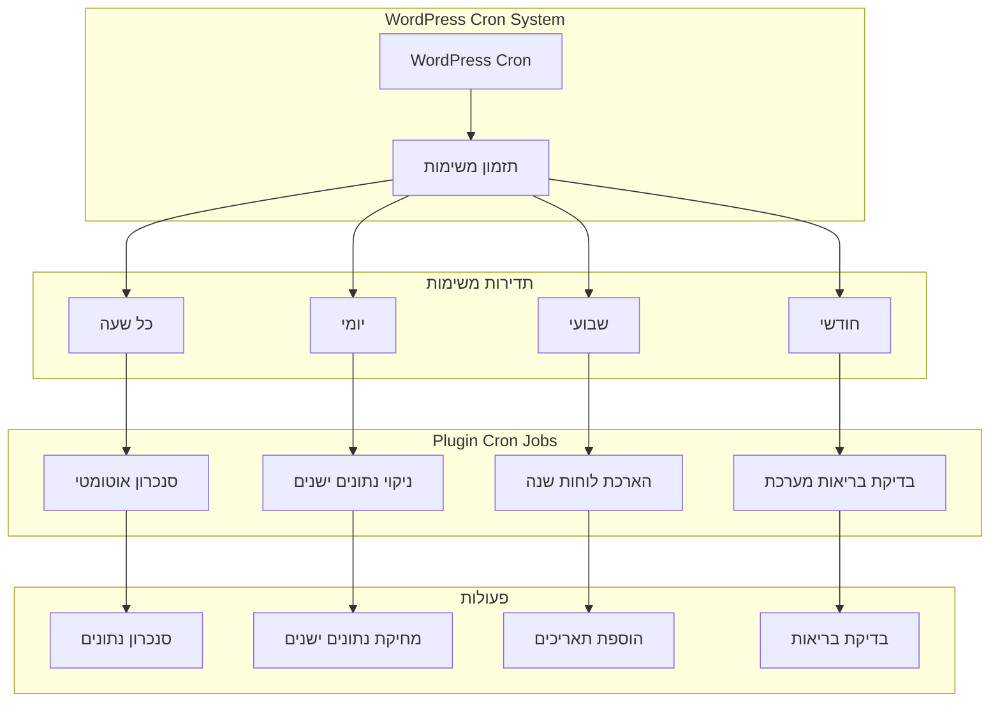
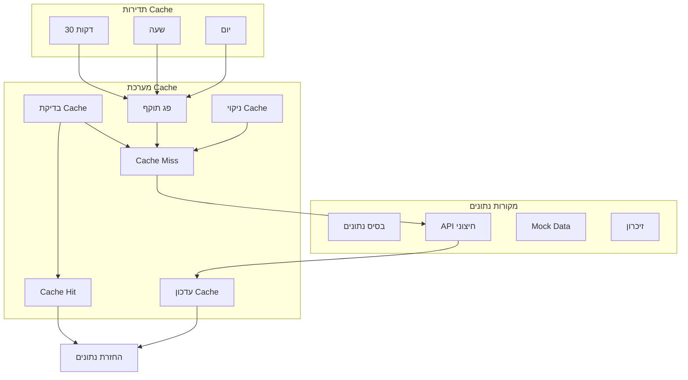
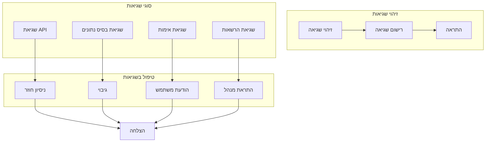
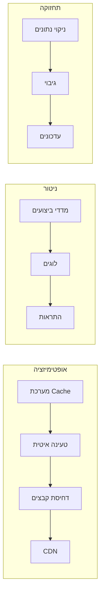

# תרשים זרימה מפורט - מערכת הצגת שעות זמינות למרפאות

## תרשים זרימת נתונים מפורטת

## תרשים זרימת הצגת שעות זמינות מפורטת

## תרשים זרימת סנכרון מפורטת

## תרשים זרימת AJAX מפורטת

## תרשים זרימת Cron Jobs מפורטת

## תרשים זרימת Cache מפורטת

## תרשים זרימת שגיאות

## תרשים זרימת ביצועים

## סיכום זרימת המערכת המפורטת

### 1. אתחול המערכת
- **טעינת התוסף**: WordPress טוען את הקובץ הראשי
- **אתחול Core**: יצירת instance של Plugin Core
- **טעינת תלויות**: טעינת כל המחלקות הנדרשות
- **יצירת טבלאות**: בדיקה ויצירת טבלאות בסיס נתונים
- **טעינת נתוני Mock**: אתחול נתונים מדמה
- **רישום Handlers**: רישום AJAX ו-REST API endpoints

### 2. זרימת משתמש מפורטת
- **כניסה לאתר**: משתמש נכנס לאתר WordPress
- **זיהוי ווידג'ט**: Elementor מזהה את הווידג'ט
- **טעינת נכסים**: טעינת CSS ו-JavaScript
- **בחירת פרמטרים**: משתמש בוחר רופא ומרפאה
- **בקשת נתונים**: AJAX request לנתוני תורים
- **עיבוד נתונים**: עיבוד והצגת נתונים
- **בחירת תור**: משתמש בוחר תאריך ושעה
- **הצגת שעות זמינות**: הצגת השעות הזמינות

### 3. זרימת ניהול מפורטת
- **כניסה לממשק ניהול**: מנהל נכנס לממשק הניהול
- **דשבורד**: הצגת סטטיסטיקות כלליות
- **ניהול לוחות שנה**: הוספה, עריכה, מחיקה של לוחות שנה
- **סטטוס סנכרון**: מעקב אחר סטטוס סנכרון
- **משימות אוטומטיות**: הגדרת Cron Jobs
- **ניטור ביצועים**: מעקב אחר ביצועי המערכת

### 4. זרימת סנכרון מפורטת
- **זיהוי צורך בסנכרון**: בדיקת תאריך עדכון אחרון
- **קבלת נתונים**: קריאה ל-API חיצוני או Mock Data
- **אימות נתונים**: בדיקת תקינות הנתונים
- **עיבוד נתונים**: המרת פורמט הנתונים
- **עדכון בסיס נתונים**: שמירת נתונים בטבלאות
- **עדכון Cache**: עדכון מערכת ה-Cache
- **רישום סטטוס**: רישום סטטוס הסנכרון

### 5. זרימת ביצועים מפורטת
- **מערכת Cache**: Cache של 30 דקות לנתונים
- **טעינה איטית**: טעינה איטית של נכסים
- **דחיסת קבצים**: דחיסת CSS ו-JavaScript
- **ניקוי נתונים**: ניקוי אוטומטי של נתונים ישנים
- **ניטור ביצועים**: מעקב אחר מדדי ביצועים
- **התראות**: התראות על בעיות ביצועים

המערכת מספקת פתרון מקיף ומפורט להצגת שעות זמינות במרפאות עם כל התכונות הנדרשות להצגה מקצועית ויעילה.

