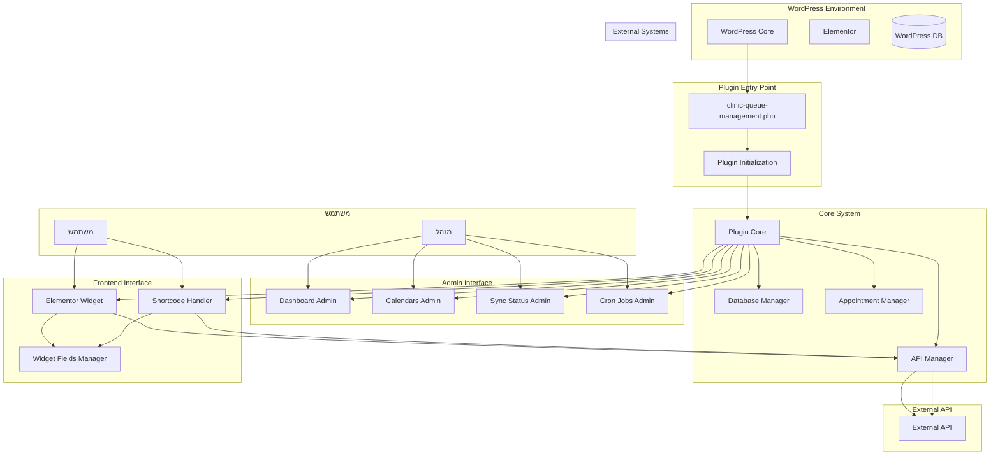
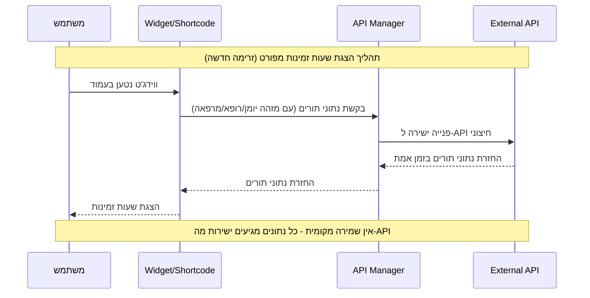
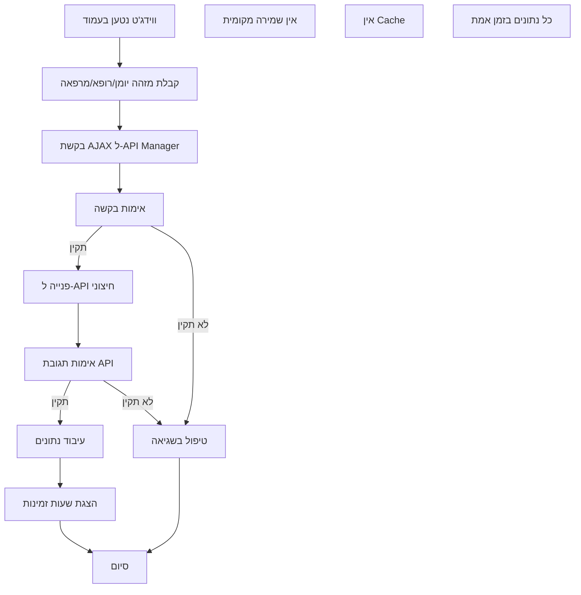
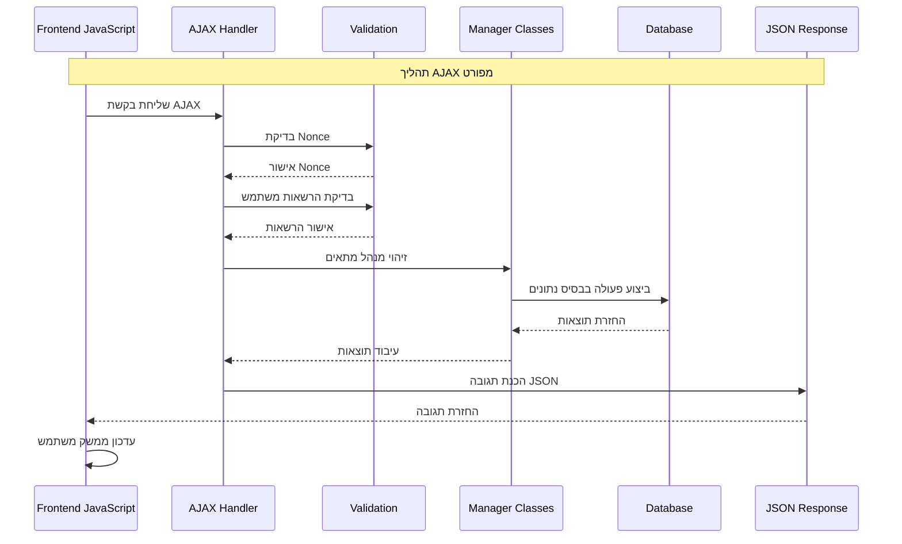
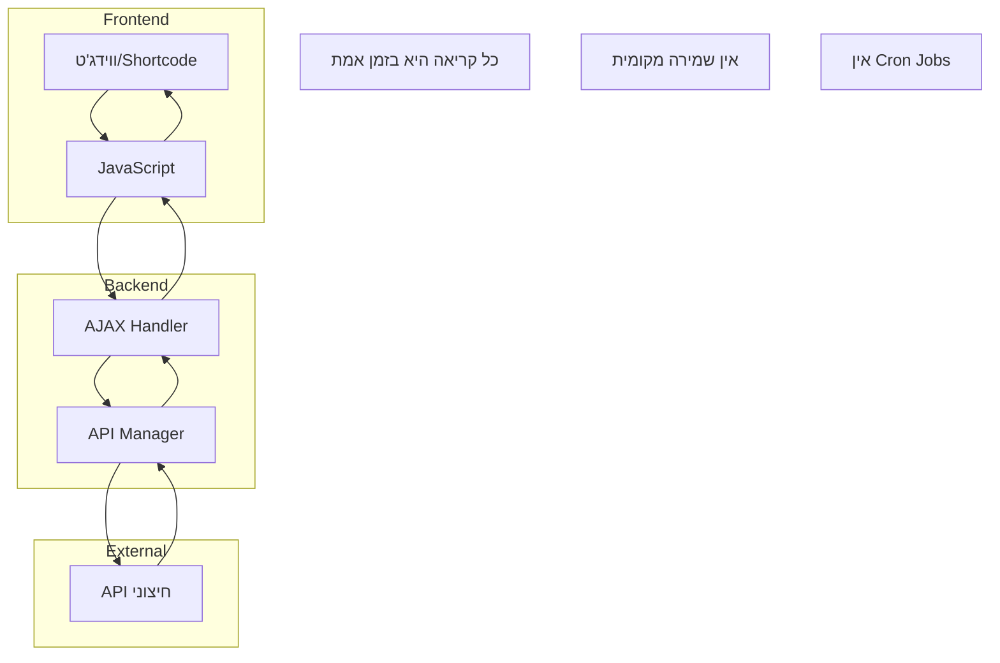
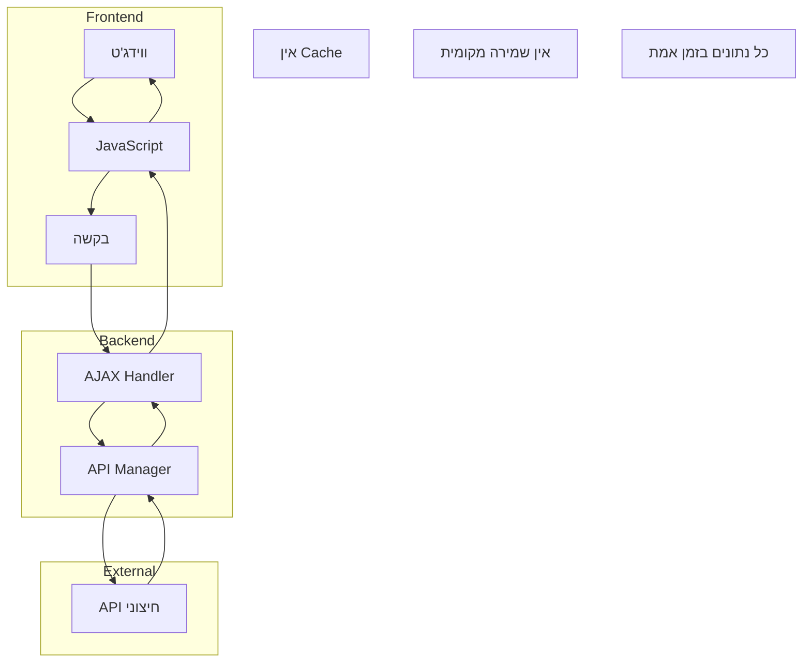
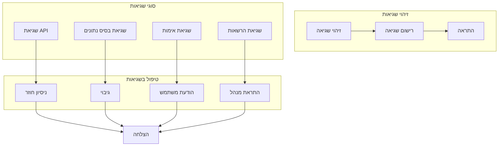
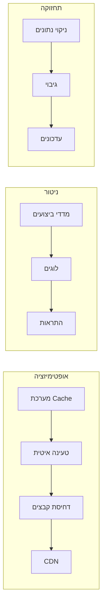

# תרשים זרימה מפורט - מערכת הצגת שעות זמינות למרפאות

## תרשים זרימת נתונים מפורטת

## תרשים זרימת הצגת שעות זמינות מפורטת

## תרשים זרימת קבלת תורים מפורטת (זרימה חדשה)

## תרשים זרימת AJAX מפורטת

## תרשים זרימת AJAX מפורטת (זרימה חדשה)

## תרשים זרימת נתונים מפורטת (זרימה חדשה - ללא Cache)

## תרשים זרימת שגיאות

## תרשים זרימת ביצועים

## סיכום זרימת המערכת המפורטת

### 1. אתחול המערכת
- **טעינת התוסף**: WordPress טוען את הקובץ הראשי
- **אתחול Core**: יצירת instance של Plugin Core
- **טעינת תלויות**: טעינת כל המחלקות הנדרשות
- **רישום Handlers**: רישום AJAX ו-REST API endpoints
- **רישום ווידג'טים**: רישום ווידג'ט Elementor ו-Shortcode

### 2. זרימת משתמש מפורטת (זרימה חדשה)
- **כניסה לאתר**: משתמש נכנס לאתר WordPress
- **זיהוי ווידג'ט**: Elementor מזהה את הווידג'ט
- **טעינת נכסים**: טעינת CSS ו-JavaScript
- **טעינת ווידג'ט**: JavaScript מזהה את הווידג'ט בעמוד
- **קבלת מזהה**: JavaScript מקבל מזהה יומן/רופא/מרפאה מהווידג'ט
- **בקשת נתונים**: AJAX request ל-API Manager עם המזהה
- **פנייה ל-API**: API Manager פונה ישירות ל-API החיצוני
- **קבלת נתונים**: קבלת נתוני תורים בזמן אמת מה-API
- **עיבוד נתונים**: עיבוד והצגת נתונים
- **הצגת שעות זמינות**: הצגת השעות הזמינות למשתמש

### 3. זרימת ניהול מפורטת
- **כניסה לממשק ניהול**: מנהל נכנס לממשק הניהול
- **דשבורד**: הצגת מידע כללי על התוסף

### 4. זרימת ביצועים מפורטת (זרימה חדשה)
- **פנייה ישירה ל-API**: כל קריאה היא ישירה ל-API החיצוני
- **אין Cache**: אין שמירה מקומית של נתונים
- **טעינה איטית**: טעינה איטית של נכסים
- **דחיסת קבצים**: דחיסת CSS ו-JavaScript
- **ניטור ביצועים**: מעקב אחר מדדי ביצועים
- **התראות**: התראות על בעיות ביצועים

המערכת מספקת פתרון מקיף ומפורט להצגת שעות זמינות במרפאות עם כל התכונות הנדרשות להצגה מקצועית ויעילה.

