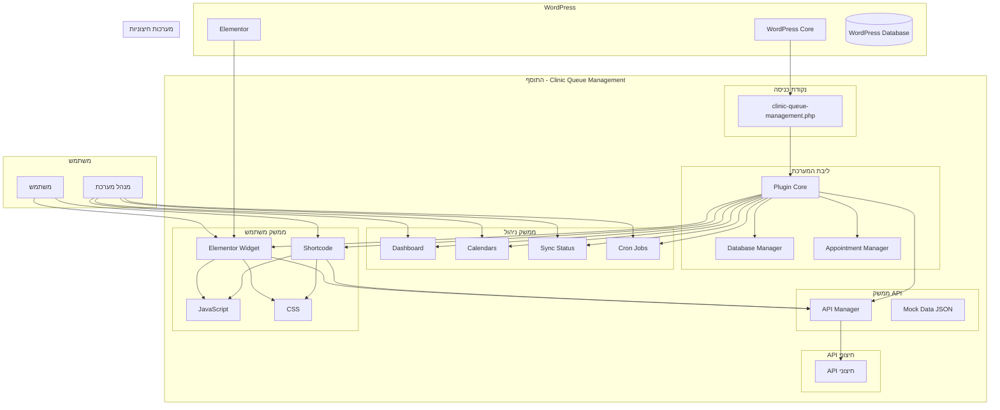
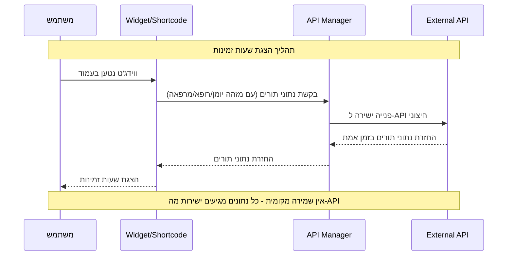
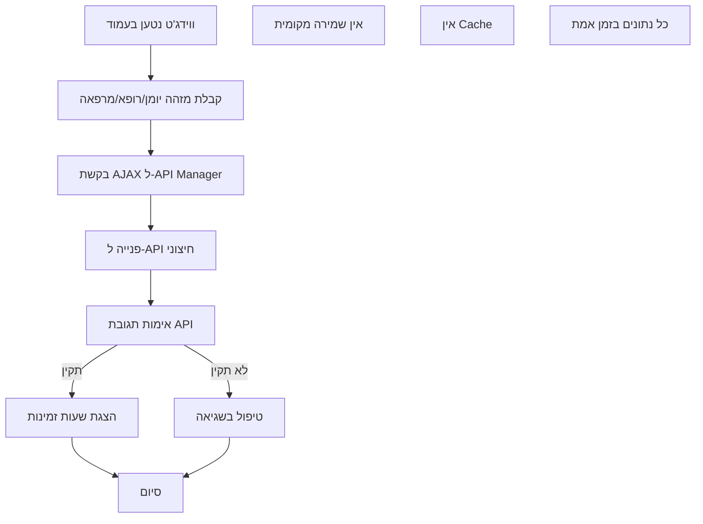
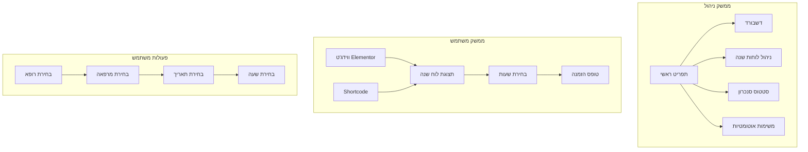
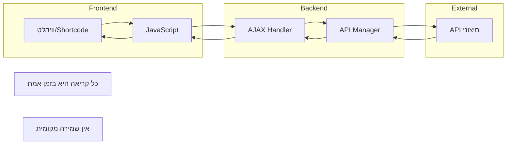
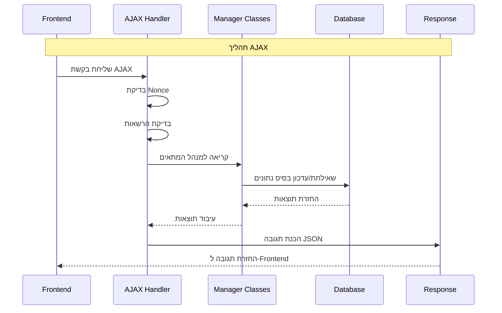
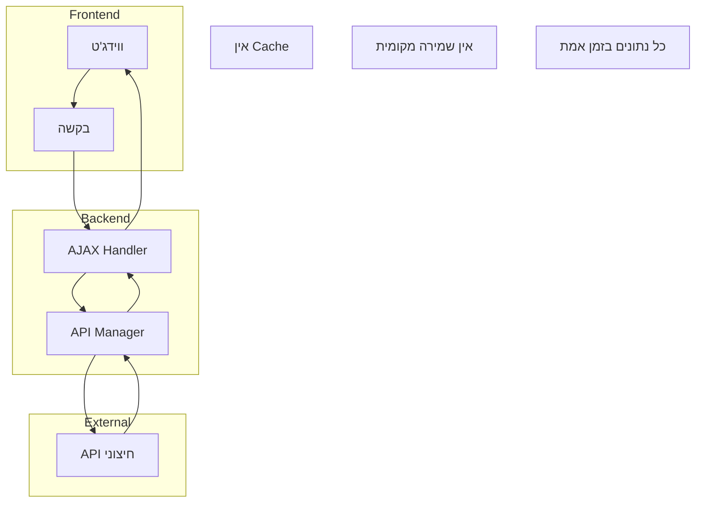

# תרשים זרימה - מערכת הצגת שעות זמינות למרפאות

## תרשים זרימה כללי של המערכת



## תרשים זרימת נתונים - תהליך הזמנת תור



## תרשים זרימת קבלת תורים (זרימה חדשה)



## תרשים מבנה נתונים (API Response)

```mermaid
erDiagram
    API_RESPONSE {
        string calendar_id
        string doctor_id
        string clinic_id
    }
    
    AVAILABLE_SLOTS {
        date date
        array time_slots
    }
    
    TIME_SLOT {
        string time
        boolean available
    }
    
    API_RESPONSE ||--o{ AVAILABLE_SLOTS : "מכיל"
    AVAILABLE_SLOTS ||--o{ TIME_SLOT : "מכיל"
    
    Note1[אין מסד נתונים מקומי]
    Note2[כל נתונים מגיעים מה-API]
```

## תרשים ממשק משתמש - זרימת משתמש



## תרשים זרימת AJAX (זרימה חדשה)



## תרשים זרימת AJAX



## תרשים זרימת נתונים (זרימה חדשה - ללא Cache)



## סיכום זרימת המערכת

### 1. אתחול המערכת
- טעינת התוסף ב-WordPress
- רישום AJAX handlers
- רישום REST API endpoints
- רישום ווידג'טים

### 2. זרימת משתמש (זרימה חדשה)
- משתמש נכנס לאתר
- ווידג'ט/Shortcode נטען בעמוד
- JavaScript פונה ל-API Manager עם מזהה יומן/רופא/מרפאה
- API Manager פונה ישירות ל-API החיצוני
- נתונים מוחזרים ומוצגים למשתמש
- אין שמירה מקומית - כל נתונים בזמן אמת

### 3. זרימת ניהול
- מנהל נכנס לממשק הניהול
- רואה דשבורד עם מידע כללי

### 4. זרימת ביצועים
- פנייה ישירה ל-API בכל טעינת ווידג'ט
- אין Cache - כל נתונים בזמן אמת
- ניטור ביצועים
- לוגים ושגיאות

המערכת מספקת פתרון מקיף לניהול תורים במרפאות עם ארכיטקטורה מודולרית, ממשק משתמש אינטואיטיבי, ותמיכה מלאה בעברית.


