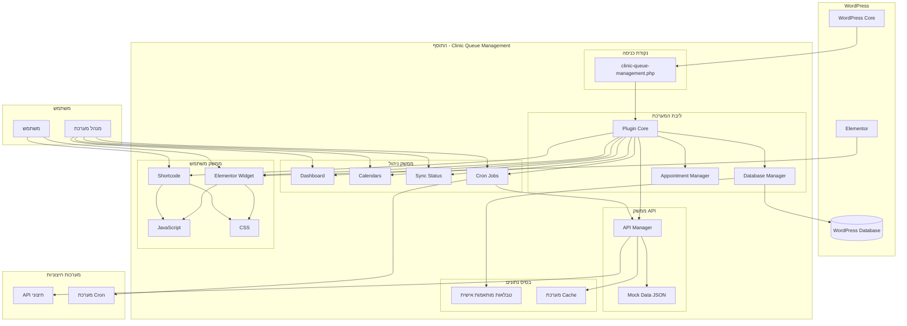
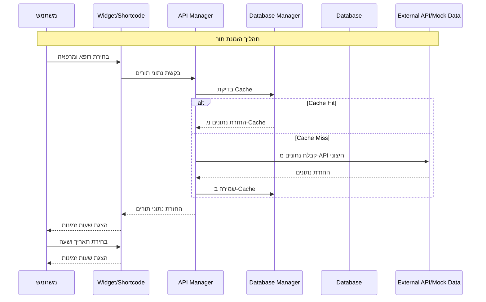
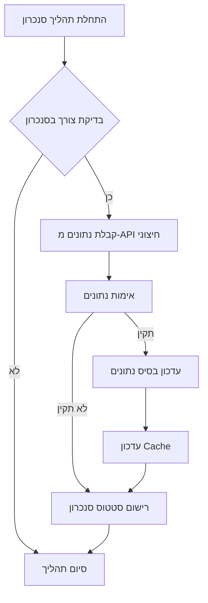
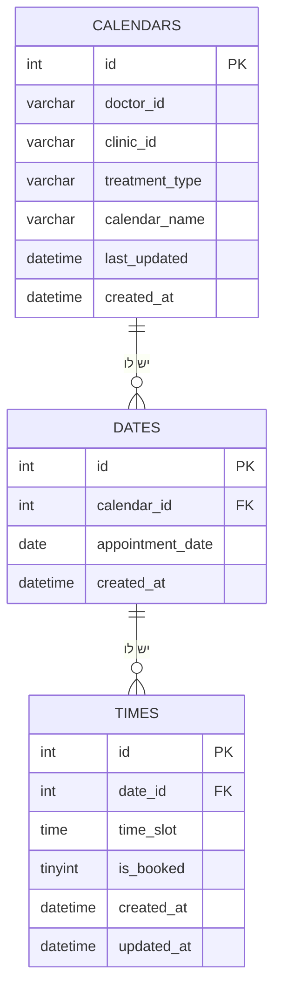
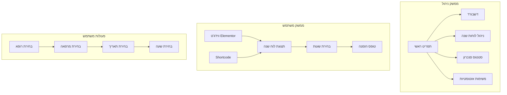
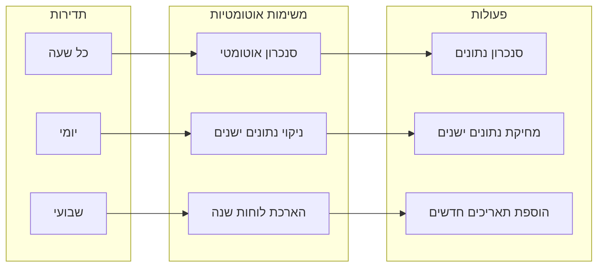
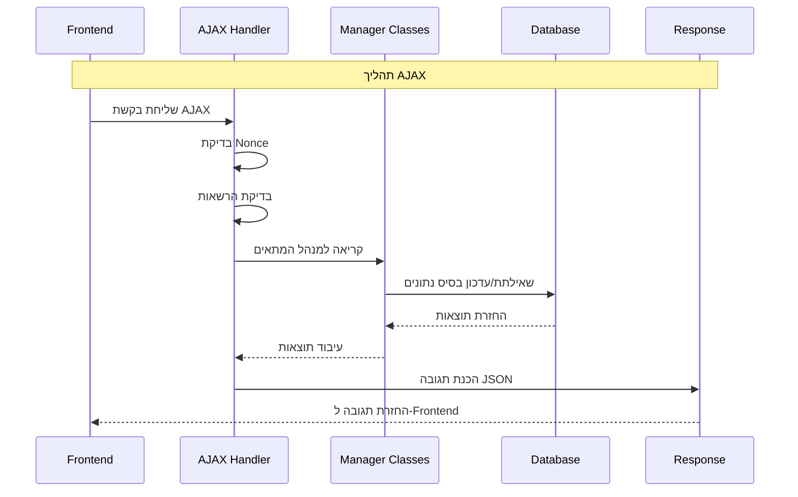
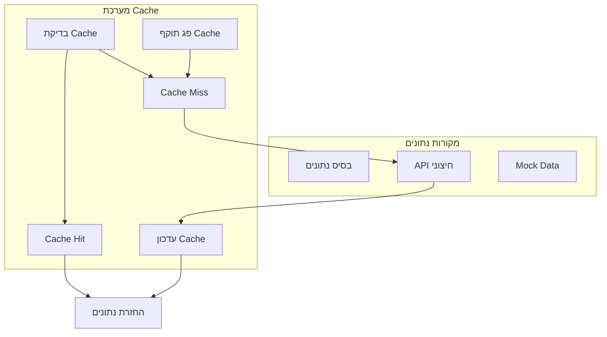

# תרשים זרימה - מערכת הצגת שעות זמינות למרפאות

## תרשים זרימה כללי של המערכת

## תרשים זרימת נתונים - תהליך הזמנת תור

## תרשים זרימת סנכרון נתונים

## תרשים מבנה בסיס הנתונים

## תרשים ממשק משתמש - זרימת משתמש

## תרשים זרימת Cron Jobs

## תרשים זרימת AJAX

## תרשים זרימת Cache

## סיכום זרימת המערכת

### 1. אתחול המערכת
- טעינת התוסף ב-WordPress
- יצירת טבלאות בסיס נתונים
- טעינת נתוני Mock
- רישום AJAX handlers
- רישום REST API endpoints

### 2. זרימת משתמש
- משתמש נכנס לאתר
- רואה ווידג'ט או Shortcode
- בוחר רופא ומרפאה
- רואה תאריכים ושעות זמינות
- בוחר תאריך ושעה

### 3. זרימת ניהול
- מנהל נכנס לממשק הניהול
- רואה דשבורד עם סטטיסטיקות
- מנהל לוחות שנה
- עוקב אחר סטטוס סנכרון
- מגדיר משימות אוטומטיות

### 4. זרימת סנכרון
- בדיקת צורך בסנכרון
- קבלת נתונים מ-API חיצוני
- אימות ועיבוד נתונים
- עדכון בסיס נתונים
- עדכון Cache
- רישום סטטוס

### 5. זרימת ביצועים
- Cache של 30 דקות
- ניקוי אוטומטי של נתונים ישנים
- סנכרון תקופתי
- ניטור ביצועים
- לוגים ושגיאות

המערכת מספקת פתרון מקיף לניהול תורים במרפאות עם ארכיטקטורה מודולרית, ממשק משתמש אינטואיטיבי, ותמיכה מלאה בעברית.

