# דוגמאות קוד Mermaid להצגה גרפית

## 1. תרשים זרימה פשוט - הזמנת תור

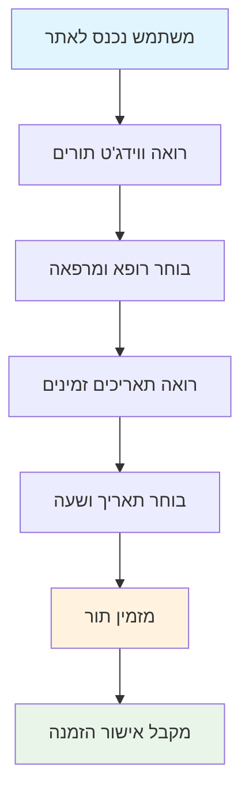

## 2. תרשים זרימת נתונים - תהליך AJAX

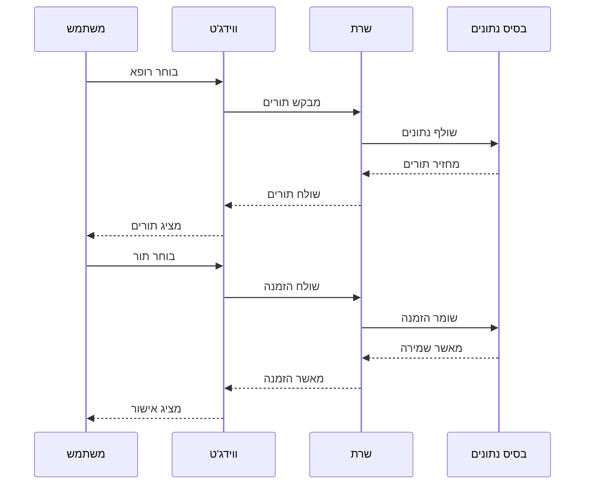

## 3. תרשים ארכיטקטורה - מבנה המערכת

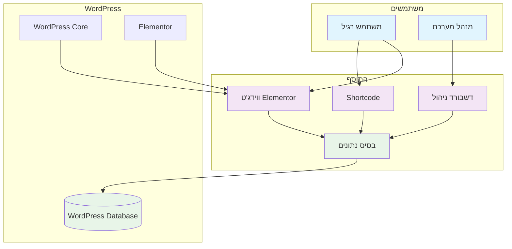

## 4. תרשים זרימת סנכרון

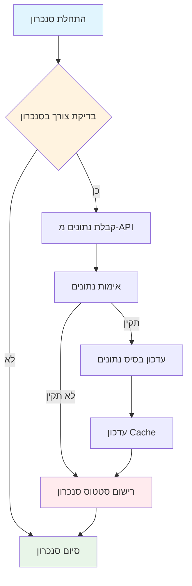

## 5. תרשים מבנה בסיס נתונים

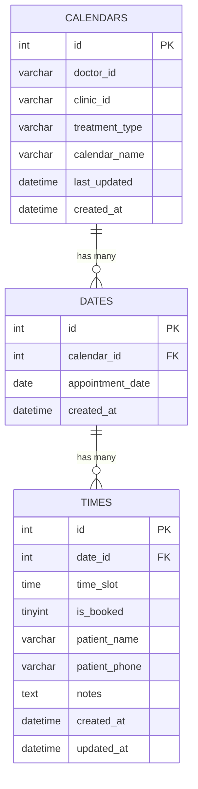

## 6. תרשים זרימת Cron Jobs

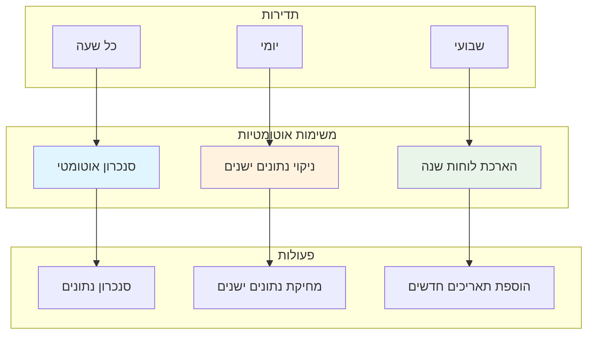

## 7. תרשים זרימת Cache

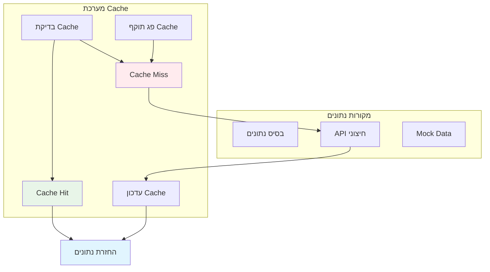

## 8. תרשים זרימת AJAX מפורטת

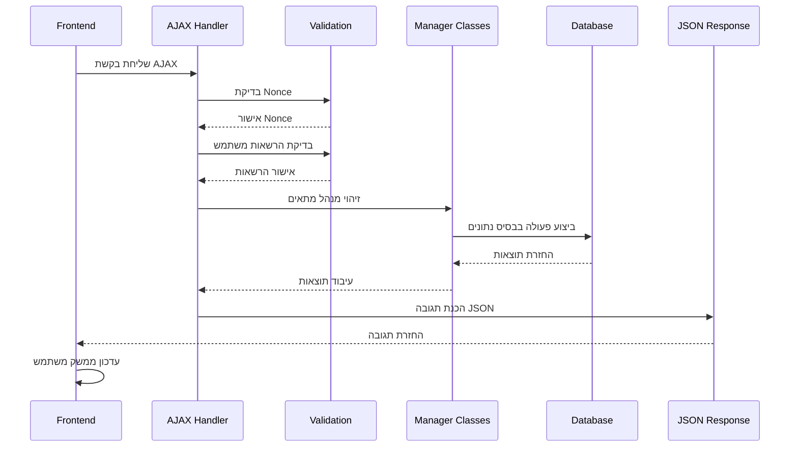

## 9. תרשים זרימת שגיאות

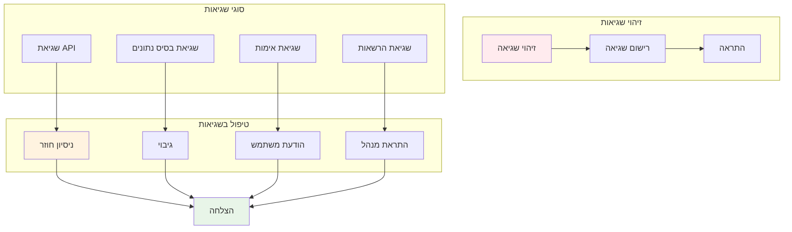

## 10. תרשים זרימת ביצועים

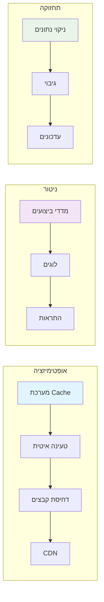

## איך להשתמש בדוגמאות

### 1. העתק את הקוד
העתק את הקוד Mermaid (החלק בין ```mermaid ו-```)

### 2. הצג ב-Mermaid Live Editor
1. לך לאתר: https://mermaid.live/
2. הדבק את הקוד
3. התרשים יוצג אוטומטית

### 3. ייצא כתמונה
1. לחץ על "Actions" → "Download PNG"
2. או "Download SVG"

### 4. השתמש בתיעוד
העתק את התמונה לתיעוד, מצגות, או כל מטרה אחרת

## טיפים לעיצוב טוב

### 1. השתמש בצבעים
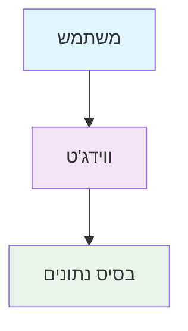

### 2. השתמש בחצים שונים
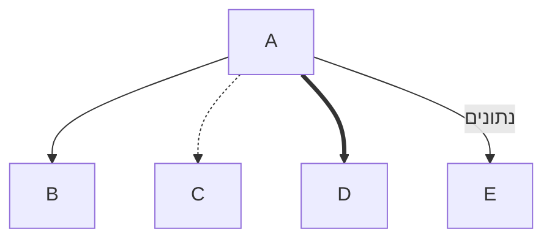

### 3. השתמש בצורות שונות
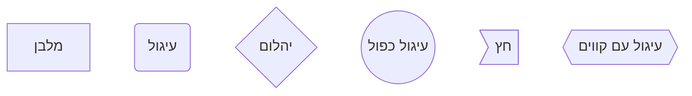

## סיכום

הדוגמאות האלה נותנות לך תרשימים מקצועיים ויפים שתוכל להשתמש בהם:
- **תיעוד** - הסבר איך המערכת עובדת
- **מצגות** - הצגת המערכת ללקוחות
- **הדרכה** - הסבר למפתחים חדשים
- **תכנון** - תכנון פיתוח עתידי

כל התרשימים כתובים בפורמט Mermaid וניתן להציג אותם בקלות בכל פלטפורמה שתומכת ב-Mermaid.


