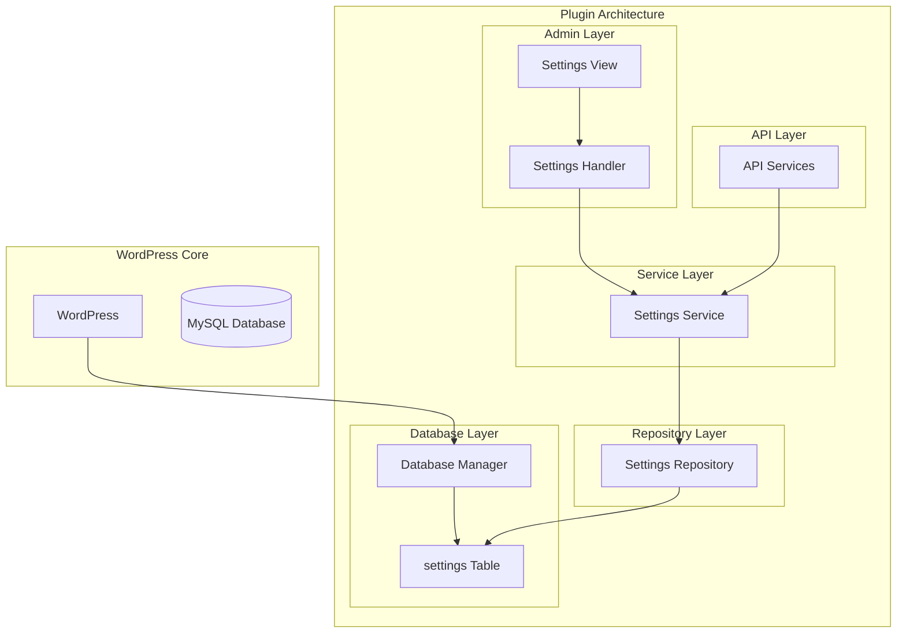

# תוכנית: טבלת הגדרות מותאמת אישית

## סקירה כללית

יצירת טבלה מותאמת אישית לאחסון הגדרות התוסף (טוקן API, כתובת שרת, והגדרות נוספות בעתיד) במקום WordPress Options.

---

## ארכיטקטורה



---

## שלב 1: Database Manager - יצירת טבלת הגדרות

### קובץ: `core/class-database-manager.php`

**תפקידים:**
- יצירת טבלת `wp_clinic_queue_settings`
- ניהול גרסאות מסד נתונים
- עדכון אוטומטי של הטבלה
- Migration מ-WordPress Options (אם קיימים)

**מבנה הטבלה:**
```sql
CREATE TABLE wp_clinic_queue_settings (
    id BIGINT(20) UNSIGNED NOT NULL AUTO_INCREMENT,
    setting_key VARCHAR(100) NOT NULL,
    setting_value LONGTEXT DEFAULT NULL,
    setting_type ENUM('string', 'number', 'boolean', 'json', 'encrypted') DEFAULT 'string',
    is_encrypted TINYINT(1) DEFAULT 0,
    description TEXT DEFAULT NULL,
    created_at DATETIME NOT NULL,
    updated_at DATETIME NOT NULL,
    PRIMARY KEY (id),
    UNIQUE KEY setting_key (setting_key),
    KEY setting_type (setting_type)
) ENGINE=InnoDB DEFAULT CHARSET=utf8mb4 COLLATE=utf8mb4_unicode_ci;
```

**שדות:**
- `setting_key`: מפתח ההגדרה (למשל: `api_token`, `api_endpoint`)
- `setting_value`: הערך (מוצפן אם `is_encrypted = 1`)
- `setting_type`: סוג הערך (string, number, boolean, json, encrypted)
- `is_encrypted`: האם הערך מוצפן (1 = כן, 0 = לא)
- `description`: תיאור ההגדרה (לשימוש עתידי)

**הערות:**
- `UNIQUE KEY` על `setting_key` למניעת כפילויות
- `LONGTEXT` לתמיכה בערכים ארוכים (טוקנים מוצפנים)
- `ENGINE=InnoDB` לתמיכה ב-Transactions

---

## שלב 2: Settings Repository

### קובץ: `database/repositories/class-settings-repository.php`

**תפקידים:**
- CRUD operations על טבלת settings
- שליפת הגדרה לפי key
- עדכון הגדרה
- מחיקת הגדרה
- שליפת כל ההגדרות

**מבנה:**
```php
class Clinic_Queue_Settings_Repository {
    - $table_name
    - $db_manager
    
    + get($key, $default = null) // Get single setting
    + set($key, $value, $type = 'string', $is_encrypted = false, $description = null) // Set/Update setting
    + delete($key) // Delete setting
    + get_all() // Get all settings as array
    + exists($key) // Check if setting exists
    + migrate_from_options() // Migrate from WordPress Options
}
```

**דוגמאות שימוש:**
```php
// Get setting
$token = $repository->get('api_token');

// Set setting
$repository->set('api_token', $encrypted_token, 'encrypted', true, 'API Authentication Token');

// Get all settings
$all_settings = $repository->get_all();
```

---

## שלב 3: Settings Service

### קובץ: `database/services/class-settings-service.php`

**תפקידים:**
- Business logic לניהול הגדרות
- Encryption/Decryption אוטומטי
- Validation
- Cache management

**מבנה:**
```php
class Clinic_Queue_Settings_Service {
    - $repository
    - $encryption_service
    - $cache_service
    
    + get_api_token() // Get decrypted API token
    + set_api_token($token) // Set encrypted API token
    + get_api_endpoint() // Get API endpoint
    + set_api_endpoint($endpoint) // Set API endpoint
    + get_setting($key, $default = null) // Get any setting
    + set_setting($key, $value, $options = array()) // Set any setting
    + delete_setting($key) // Delete setting
    + get_all_settings() // Get all settings
    + migrate_from_options() // Migrate existing options
}
```

**Encryption:**
- הגדרות עם `is_encrypted = true` יוצפנו אוטומטית
- פענוח אוטומטי בעת שליפה
- שימוש ב-`Encryption_Service` הקיים

**Cache:**
- Cache של כל ההגדרות (TTL: 1 שעה)
- Invalidate cache על כל שינוי

---

## שלב 4: עדכון Settings Handler

### קובץ: `admin/handlers/class-settings-handler.php`

**שינויים:**
- החלפת `get_option()` / `update_option()` ב-`Settings_Service`
- שמירת טוקן דרך `$settings_service->set_api_token()`
- שליפת טוקן דרך `$settings_service->get_api_token()`
- שמירת endpoint דרך `$settings_service->set_api_endpoint()`
- שליפת endpoint דרך `$settings_service->get_api_endpoint()`

**לפני:**
```php
$encrypted_token = get_option('clinic_queue_api_token_encrypted', null);
update_option('clinic_queue_api_token_encrypted', $encrypted);
```

**אחרי:**
```php
$settings_service = Clinic_Queue_Settings_Service::get_instance();
$settings_service->set_api_token($token);
$token = $settings_service->get_api_token();
```

---

## שלב 5: עדכון API Services

### קבצים לעדכון:
- `api/services/class-base-service.php`
- `api/class-api-manager.php`

**שינויים:**
- החלפת `get_option('clinic_queue_api_token_encrypted')` ב-`Settings_Service`
- שליפת טוקן דרך `$settings_service->get_api_token()`
- שליפת endpoint דרך `$settings_service->get_api_endpoint()`

**לפני:**
```php
$encrypted_token = get_option('clinic_queue_api_token_encrypted', null);
$decrypted_token = $this->decrypt_token($encrypted_token);
```

**אחרי:**
```php
$settings_service = Clinic_Queue_Settings_Service::get_instance();
$token = $settings_service->get_api_token();
```

---

## שלב 6: Migration מ-WordPress Options

### פונקציה: `migrate_from_options()`

**תפקיד:**
- העברת הגדרות קיימות מ-WordPress Options לטבלה החדשה
- שמירת תאימות לאחור (אם נדרש)
- מחיקת הגדרות ישנות (אופציונלי)

**תהליך:**
1. בדיקה אם יש הגדרות ב-WordPress Options
2. העתקת ההגדרות לטבלה החדשה
3. אימות שההעתקה הצליחה
4. מחיקת הגדרות ישנות (אופציונלי - רק אחרי אימות)

**הגדרות להעברה:**
- `clinic_queue_api_token_encrypted` → `api_token` (encrypted)
- `clinic_queue_api_endpoint` → `api_endpoint` (string)

---

## שלב 7: Integration עם Plugin Core

### עדכון: `core/class-plugin-core.php`

**שינויים:**
- טעינת Database Manager ב-`load_dependencies()`
- אתחול Database Manager ב-`init()`
- טעינת Settings Repository ו-Service
- הרצת Migration (אם נדרש)

### עדכון: `clinic-queue-management.php`

**שינויים:**
- הגדרת `CLINIC_QUEUE_MANAGEMENT_FILE` (נדרש ל-activation hook)
- הוספת `register_activation_hook` ליצירת טבלאות

---

## שלב 8: עדכון כרטיס הבדיקה

### קובץ: `admin/views/settings-html.php`

**שינויים:**
- עדכון `get_token_debug_info()` לבדוק גם בטבלה החדשה
- הצגת מידע על מיקום ההגדרה (טבלה vs Options - למשך תקופת מעבר)

---

## סדר ביצוע מומלץ

1. **Database Manager** - יצירת טבלת settings
2. **Settings Repository** - CRUD operations בסיסיים
3. **Settings Service** - Business logic + Encryption
4. **Migration** - העברת הגדרות קיימות
5. **Settings Handler** - עדכון לוגיקת השמירה
6. **API Services** - עדכון שליפת טוקן
7. **Testing** - בדיקת כל הפונקציונליות

---

## קבצים ליצירה

### Core:
- `core/class-database-manager.php` (או עדכון קיים)

### Database:
- `database/repositories/class-settings-repository.php`
- `database/repositories/index.php`

### Services:
- `database/services/class-settings-service.php`
- `database/services/index.php`

---

## קבצים לעדכון

### Admin:
- `admin/handlers/class-settings-handler.php`
- `admin/views/settings-html.php`

### API:
- `api/services/class-base-service.php`
- `api/class-api-manager.php`

### Core:
- `core/class-plugin-core.php`
- `clinic-queue-management.php`

---

## יתרונות הטבלה החדשה

1. **גמישות:**
   - קל להוסיף הגדרות חדשות
   - תמיכה בסוגי ערכים שונים (string, number, boolean, json)
   - תמיכה ב-encryption per-setting

2. **ביצועים:**
   - שאילתות מהירות יותר
   - אינדקסים מותאמים
   - Cache יעיל יותר

3. **תחזוקה:**
   - כל ההגדרות במקום אחד
   - קל לנהל ולעדכן
   - תיעוד מובנה (description field)

4. **אבטחה:**
   - Encryption per-setting
   - שליטה מלאה על הגישה
   - Audit trail (created_at, updated_at)

---

## הערות חשובות

1. **תאימות לאחור:**
   - במשך תקופת מעבר, אפשר לקרוא גם מ-Options וגם מהטבלה
   - אחרי Migration מוצלח, אפשר להסיר את התמיכה ב-Options

2. **Security:**
   - Encryption אוטומטי להגדרות רגישות
   - Sanitization של כל הקלט
   - Validation מלא

3. **Performance:**
   - Cache של כל ההגדרות
   - Invalidate cache על שינויים
   - Query optimization

4. **Testing:**
   - בדיקת Migration
   - בדיקת Encryption/Decryption
   - בדיקת תאימות לאחור

---

## דוגמאות שימוש

### שליפת טוקן:
```php
$settings_service = Clinic_Queue_Settings_Service::get_instance();
$token = $settings_service->get_api_token();
```

### שמירת טוקן:
```php
$settings_service = Clinic_Queue_Settings_Service::get_instance();
$settings_service->set_api_token($token);
```

### הגדרה מותאמת אישית:
```php
$settings_service = Clinic_Queue_Settings_Service::get_instance();
$settings_service->set_setting('custom_setting', 'value', array(
    'type' => 'string',
    'is_encrypted' => false,
    'description' => 'Custom setting description'
));
```

---

## תיעוד

- `docs/SETTINGS_TABLE.md` - תיעוד מבנה הטבלה
- `docs/MIGRATION_GUIDE.md` - מדריך Migration מ-Options

