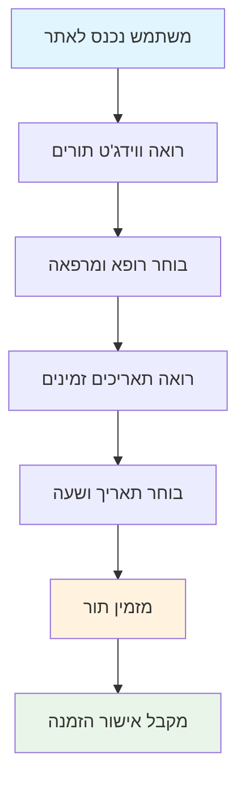
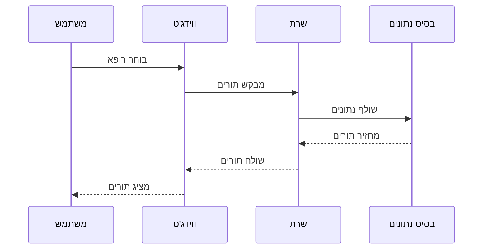
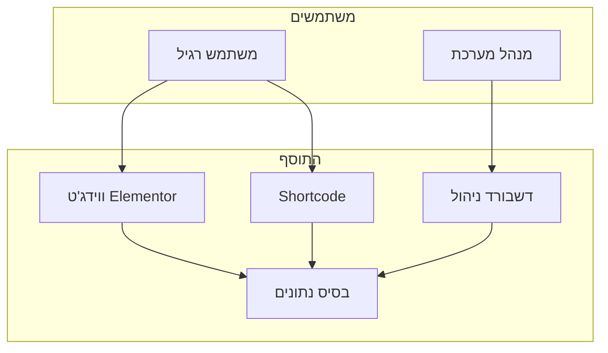
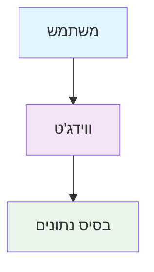
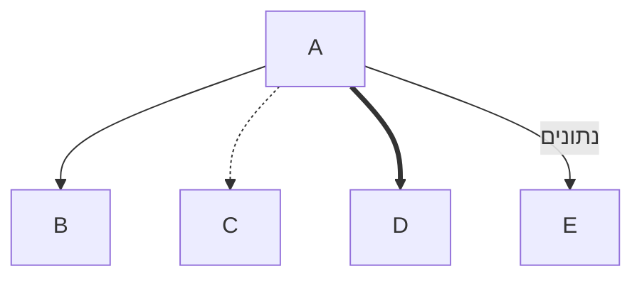
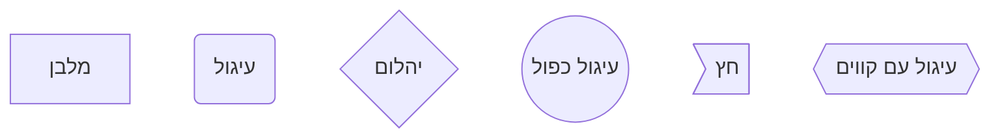
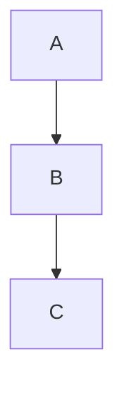
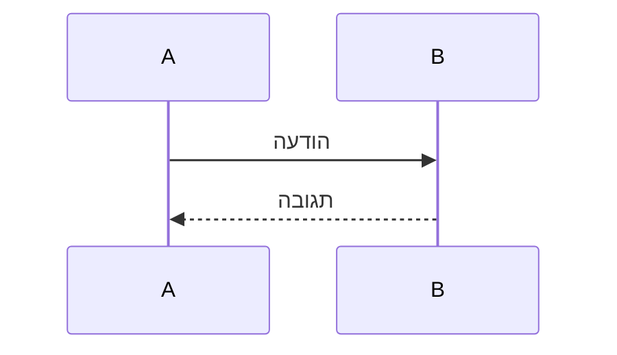
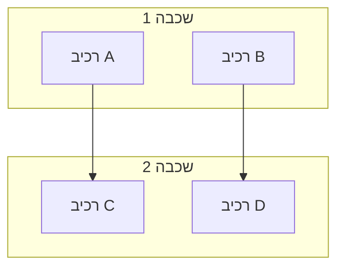
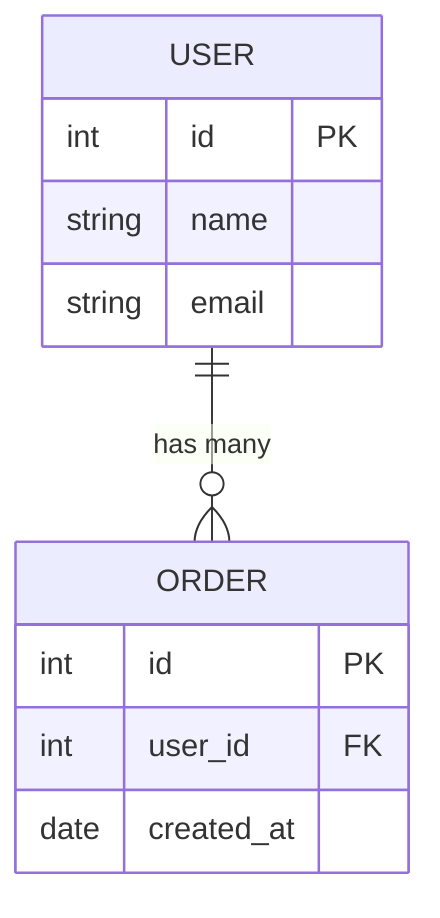

# מדריך מהיר להצגת תרשימי זרימה באופן גרפי

## 🚀 הדרך הכי מהירה - Mermaid Live Editor

### שלב 1: לך לאתר
פתח את הדפדפן ולך לאתר: **https://mermaid.live/**

### שלב 2: העתק קוד
1. פתח את הקובץ `MERMAID_EXAMPLES.md`
2. בחר את התרשים שאתה רוצה להציג
3. העתק את הקוד Mermaid (החלק בין ```mermaid ו-```)

### שלב 3: הדבק והצג
1. הדבק את הקוד ב-Mermaid Live Editor
2. התרשים יוצג אוטומטית
3. תוכל לערוך את הקוד ולשנות את התרשים

### שלב 4: ייצא כתמונה
1. לחץ על "Actions" → "Download PNG"
2. או "Download SVG" לתרשימים וקטוריים
3. שמור את התמונה

## 📱 דרכים נוספות להצגה

### 1. GitHub (אם הפרויקט שלך ב-GitHub)
- העלה את הקבצים ל-GitHub
- GitHub יציג את תרשימי Mermaid אוטומטית
- תוכל לראות אותם ישירות ב-GitHub

### 2. Visual Studio Code
1. התקן את התוסף "Mermaid Preview"
2. פתח את קובץ ה-Markdown
3. לחץ על "Open Preview" (Ctrl+Shift+V)

### 3. Notion
1. העתק את הקוד Mermaid
2. ב-Notion, השתמש ב-```mermaid
3. הדבק את הקוד
4. Notion יציג את התרשים אוטומטית

### 4. Obsidian
1. התקן את התוסף "Mermaid"
2. פתח את הקובץ
3. התרשים יוצג אוטומטית

## 🎨 עיצוב מתקדם

### אם אתה רוצה לערוך את התרשימים:

#### 1. Draw.io (חינמי)
- לך לאתר: https://app.diagrams.net/
- צור תרשים חדש
- העתק את המבנה מהתרשימים
- ערוך ועצב כרצונך

#### 2. Lucidchart (מקצועי)
- לך לאתר: https://lucidchart.com/
- צור תרשים חדש
- העתק את המבנה מהתרשימים
- ערוך ועצב כרצונך

#### 3. Figma (עיצוב מתקדם)
- לך לאתר: https://figma.com/
- צור פרויקט חדש
- העתק את המבנה מהתרשימים
- ערוך ועצב כרצונך

#### 4. Canva (יפה ופשוט)
- לך לאתר: https://canva.com/
- חפש "Flowchart" או "Diagram"
- בחר תבנית
- ערוך לפי הצורך

## 📋 דוגמאות מוכנות להעתקה

### תרשים זרימה פשוט:


### תרשים זרימת נתונים:


### תרשים ארכיטקטורה:


## 🎯 טיפים להצגה טובה

### 1. השתמש בצבעים


### 2. השתמש בחצים שונים


### 3. השתמש בצורות שונות


## 📊 סוגי תרשימים שונים

### 1. תרשים זרימה (Flowchart)


### 2. תרשים זרימת נתונים (Sequence)


### 3. תרשים ארכיטקטורה (Architecture)


### 4. תרשים בסיס נתונים (ERD)


## 🚀 סיכום - הדרך הכי מהירה

1. **לך לאתר**: https://mermaid.live/
2. **העתק קוד** מהקבצים שיצרתי
3. **הדבק ב-Mermaid Live Editor**
4. **ייצא כתמונה** (PNG או SVG)
5. **השתמש בתיעוד** או מצגות

זה ייתן לך תרשימים מקצועיים ויפים תוך דקות ספורות!

## 📁 קבצים מוכנים

כל התרשימים נשמרו בקבצים הבאים:
- `FLOW_DIAGRAM.md` - תרשימי זרימה כללים
- `DETAILED_FLOW.md` - תרשימי זרימה מפורטים
- `SYSTEM_ARCHITECTURE.md` - תרשימי ארכיטקטורה
- `SIMPLE_FLOW.md` - תרשימי זרימה פשוטים
- `MERMAID_EXAMPLES.md` - דוגמאות קוד מוכנות
- `VISUAL_DISPLAY_GUIDE.md` - מדריך הצגה מפורט
- `QUICK_START_VISUAL.md` - מדריך מהיר (הקובץ הזה)


