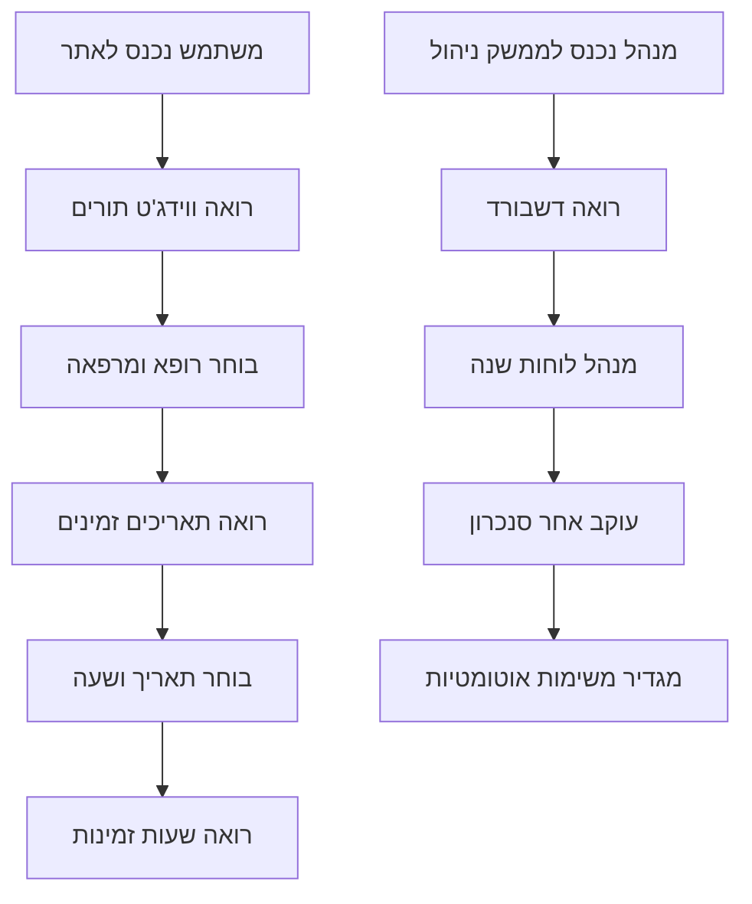
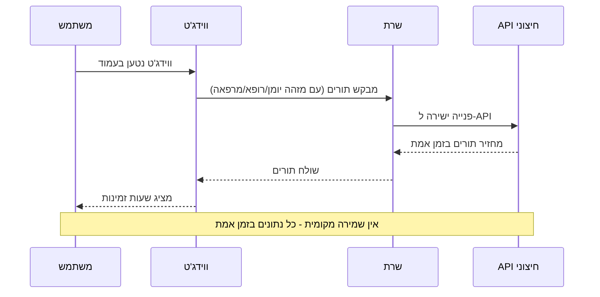
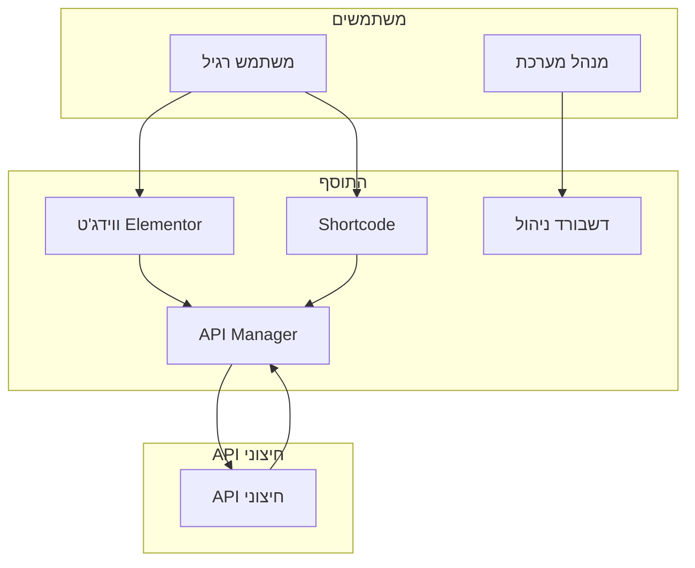

# תרשים זרימה פשוט - מערכת הצגת שעות זמינות למרפאות

## מה התוסף עושה - הסבר פשוט

התוסף הזה הוא מערכת להצגת שעות זמינות במרפאות רפואיות. הוא מאפשר למשתמשים לראות שעות זמינות דרך אתר WordPress.

## תרשים זרימה פשוט

## תרשים זרימת נתונים פשוט

## תרשים מבנה פשוט

## איך זה עובד - הסבר מפורט

### 1. התקנה ואתחול
- התוסף מותקן ב-WordPress
- רישום AJAX handlers
- רישום REST API endpoints
- רישום ווידג'טים

### 2. משתמש רואה שעות זמינות (זרימה חדשה)
1. **משתמש נכנס לאתר** - רואה ווידג'ט או Shortcode
2. **ווידג'ט נטען** - JavaScript מזהה את הווידג'ט
3. **פנייה ל-API** - JavaScript פונה ל-API Manager עם מזהה יומן/רופא/מרפאה
4. **קבלת נתונים** - API Manager פונה ישירות ל-API החיצוני ומקבל נתונים בזמן אמת
5. **הצגת שעות זמינות** - הנתונים מוצגים למשתמש
6. **אין שמירה מקומית** - כל נתונים מגיעים ישירות מה-API

### 3. מנהל מנהל את המערכת
1. **נכנס לממשק ניהול** - דרך תפריט WordPress
2. **רואה דשבורד** - מידע כללי על התוסף

### 4. איך הנתונים זורמים (זרימה חדשה)
1. **ווידג'ט נטען** - בכל טעינת עמוד עם ווידג'ט
2. **פנייה ישירה ל-API** - JavaScript פונה ל-API Manager
3. **API Manager פונה ל-API חיצוני** - עם מזהה יומן/רופא/מרפאה
4. **קבלת נתונים בזמן אמת** - כל נתונים מגיעים ישירות מה-API
5. **אין שמירה מקומית** - אין Cache, אין מסד נתונים, אין סנכרון

## רכיבי המערכת

### 1. ווידג'ט Elementor
- **מה זה**: רכיב גרירה ושחרור ב-Elementor
- **מה זה עושה**: מציג מערכת הזמנת תורים
- **איך להשתמש**: גרור ל-עמוד ב-Elementor

### 2. Shortcode
- **מה זה**: קוד קצר להטמעה בעמודים
- **מה זה עושה**: מציג מערכת הזמנת תורים
- **איך להשתמש**: הוסף `[clinic_queue]` לעמוד

### 3. דשבורד ניהול
- **מה זה**: ממשק ניהול למנהלי המערכת
- **מה זה עושה**: ניהול לוחות שנה, סנכרון, משימות
- **איך להשתמש**: תפריט "ניהול תורים" ב-WordPress

### 4. API חיצוני
- **מה זה**: API חיצוני שמספק נתוני תורים
- **מה זה עושה**: מחזיר שעות זמינות לפי מזהה יומן/רופא/מרפאה
- **איך זה עובד**: פנייה ישירה בכל טעינת ווידג'ט - אין שמירה מקומית

## תכונות מיוחדות

### 1. תמיכה בעברית
- **כיוון RTL** - תמיכה מלאה בעברית
- **פונטים עבריים** - עיצוב מותאם לעברית
- **ממשק בעברית** - כל הטקסטים בעברית

### 2. ביצועים
- **פנייה ישירה ל-API** - כל נתונים בזמן אמת
- **טעינה מהירה** - אופטימיזציה לביצועים
- **אין Cache** - אין שמירה מקומית

### 3. אבטחה
- **בדיקת הרשאות** - רק משתמשים מורשים
- **אימות נתונים** - בדיקת תקינות קלט
- **הגנה מפני התקפות** - הגנות אבטחה

## איך להתקין ולהשתמש

### 1. התקנה
1. העלה את התוסף ל-WordPress
2. הפעל את התוסף
3. התוסף יוצר טבלאות אוטומטית
4. נתוני דמו נטענים אוטומטית

### 2. שימוש ב-Elementor
1. פתח עמוד ב-Elementor
2. חפש "Clinic Queue" בווידג'טים
3. גרור ל-עמוד
4. הגדר פרמטרים (רופא, מרפאה)
5. שמור ופרסם

### 3. שימוש ב-Shortcode
1. פתח עמוד או פוסט
2. הוסף `[clinic_queue doctor_id="1" clinic_id="1"]`
3. שמור ופרסם

### 4. ניהול המערכת
1. לך ל-"ניהול תורים" בתפריט WordPress
2. השתמש בדשבורד לניהול
3. הוסף לוחות שנה חדשים
4. עקוב אחר סנכרון נתונים

## סיכום

התוסף הזה הוא מערכת מקיפה להצגת שעות זמינות במרפאות עם:
- **ממשק משתמש פשוט** - קל לשימוש
- **ממשק ניהול מתקדם** - ניהול מקצועי
- **תמיכה בעברית** - מותאם לשוק הישראלי
- **ביצועים טובים** - מהיר ויעיל
- **אבטחה גבוהה** - מוגן מפני התקפות
- **גמישות** - עובד עם Elementor ו-Shortcode

המערכת מוכנה לשימוש מיידי וניתן להתאים אותה לצרכים ספציפיים של כל מרפאה.

