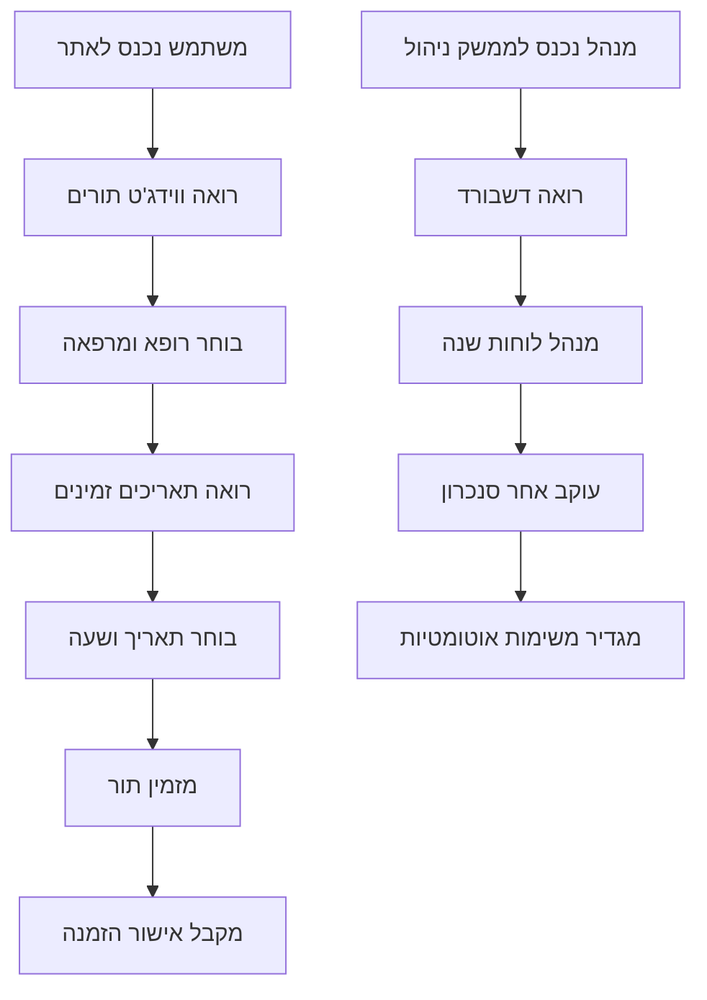
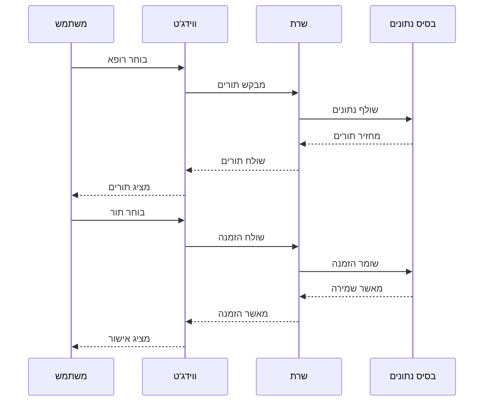
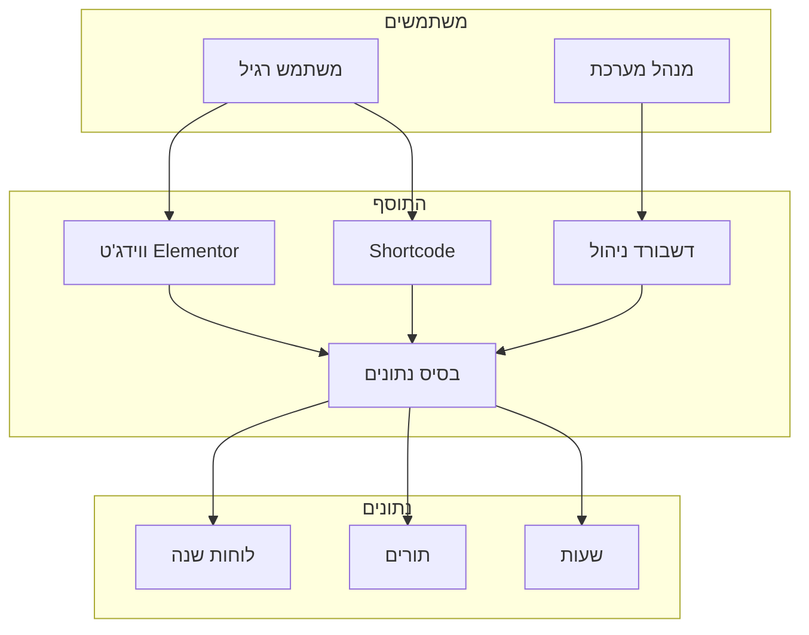

# תרשים זרימה פשוט - מערכת ניהול תורים למרפאות

## מה התוסף עושה - הסבר פשוט

התוסף הזה הוא מערכת לניהול תורים במרפאות רפואיות. הוא מאפשר למשתמשים להזמין תורים דרך אתר WordPress.

## תרשים זרימה פשוט

## תרשים זרימת נתונים פשוט

## תרשים מבנה פשוט

## איך זה עובד - הסבר מפורט

### 1. התקנה ואתחול
- התוסף מותקן ב-WordPress
- יוצר טבלאות בבסיס הנתונים
- טוען נתוני דמו
- מגדיר משימות אוטומטיות

### 2. משתמש מזמין תור
1. **משתמש נכנס לאתר** - רואה ווידג'ט או Shortcode
2. **בוחר רופא ומרפאה** - מהרשימה הזמינה
3. **רואה תאריכים זמינים** - לוח שנה עם תאריכים פנויים
4. **בוחר תאריך ושעה** - מתוך השעות הזמינות
5. **מזמין תור** - לוחץ על כפתור הזמנה
6. **מקבל אישור** - הודעה שהתור נשמר

### 3. מנהל מנהל את המערכת
1. **נכנס לממשק ניהול** - דרך תפריט WordPress
2. **רואה דשבורד** - סטטיסטיקות ומידע כללי
3. **מנהל לוחות שנה** - מוסיף, עורך, מוחק לוחות שנה
4. **עוקב אחר סנכרון** - רואה מתי הנתונים עודכנו
5. **מגדיר משימות אוטומטיות** - מתי לעדכן נתונים

### 4. איך הנתונים זורמים
1. **נתונים נטענים** - מ-Mock Data או API חיצוני
2. **נשמרים בבסיס נתונים** - בטבלאות מותאמות אישית
3. **מערכת Cache** - שומרת נתונים לזמן מה
4. **עדכון אוטומטי** - משימות Cron מעדכנות נתונים
5. **ניקוי אוטומטי** - מחיקת נתונים ישנים

## רכיבי המערכת

### 1. ווידג'ט Elementor
- **מה זה**: רכיב גרירה ושחרור ב-Elementor
- **מה זה עושה**: מציג מערכת הזמנת תורים
- **איך להשתמש**: גרור ל-עמוד ב-Elementor

### 2. Shortcode
- **מה זה**: קוד קצר להטמעה בעמודים
- **מה זה עושה**: מציג מערכת הזמנת תורים
- **איך להשתמש**: הוסף `[clinic_queue]` לעמוד

### 3. דשבורד ניהול
- **מה זה**: ממשק ניהול למנהלי המערכת
- **מה זה עושה**: ניהול לוחות שנה, סנכרון, משימות
- **איך להשתמש**: תפריט "ניהול תורים" ב-WordPress

### 4. בסיס נתונים
- **מה זה**: טבלאות מותאמות אישית
- **מה זה עושה**: שומר תורים, לוחות שנה, שעות
- **איך זה עובד**: נוצר אוטומטית בעת ההתקנה

## תכונות מיוחדות

### 1. תמיכה בעברית
- **כיוון RTL** - תמיכה מלאה בעברית
- **פונטים עבריים** - עיצוב מותאם לעברית
- **ממשק בעברית** - כל הטקסטים בעברית

### 2. ביצועים
- **Cache חכם** - שומר נתונים לזמן מה
- **טעינה מהירה** - אופטימיזציה לביצועים
- **ניקוי אוטומטי** - מחיקת נתונים ישנים

### 3. אבטחה
- **בדיקת הרשאות** - רק משתמשים מורשים
- **אימות נתונים** - בדיקת תקינות קלט
- **הגנה מפני התקפות** - הגנות אבטחה

## איך להתקין ולהשתמש

### 1. התקנה
1. העלה את התוסף ל-WordPress
2. הפעל את התוסף
3. התוסף יוצר טבלאות אוטומטית
4. נתוני דמו נטענים אוטומטית

### 2. שימוש ב-Elementor
1. פתח עמוד ב-Elementor
2. חפש "Clinic Queue" בווידג'טים
3. גרור ל-עמוד
4. הגדר פרמטרים (רופא, מרפאה)
5. שמור ופרסם

### 3. שימוש ב-Shortcode
1. פתח עמוד או פוסט
2. הוסף `[clinic_queue doctor_id="1" clinic_id="1"]`
3. שמור ופרסם

### 4. ניהול המערכת
1. לך ל-"ניהול תורים" בתפריט WordPress
2. השתמש בדשבורד לניהול
3. הוסף לוחות שנה חדשים
4. עקוב אחר סנכרון נתונים

## סיכום

התוסף הזה הוא מערכת מקיפה לניהול תורים במרפאות עם:
- **ממשק משתמש פשוט** - קל לשימוש
- **ממשק ניהול מתקדם** - ניהול מקצועי
- **תמיכה בעברית** - מותאם לשוק הישראלי
- **ביצועים טובים** - מהיר ויעיל
- **אבטחה גבוהה** - מוגן מפני התקפות
- **גמישות** - עובד עם Elementor ו-Shortcode

המערכת מוכנה לשימוש מיידי וניתן להתאים אותה לצרכים ספציפיים של כל מרפאה.

