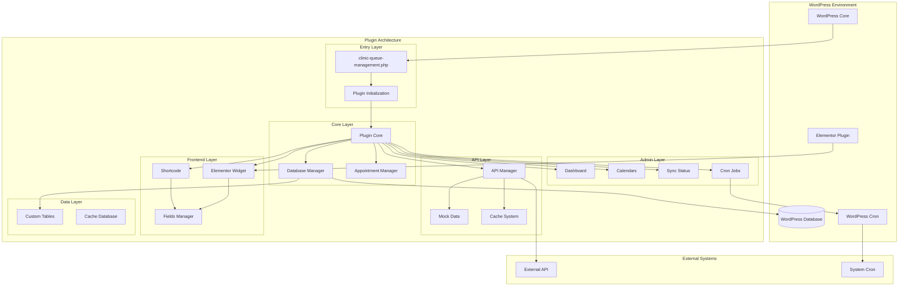
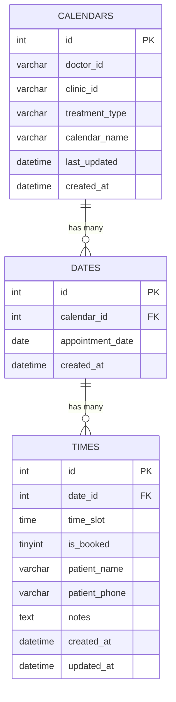
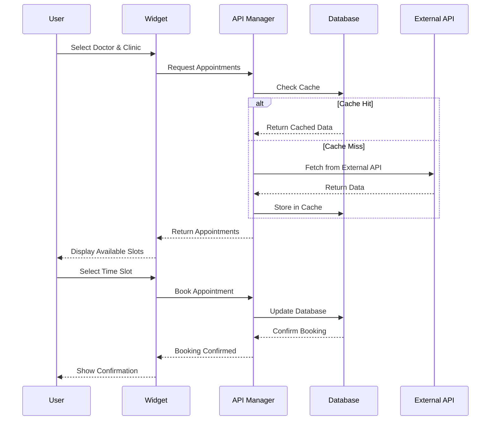
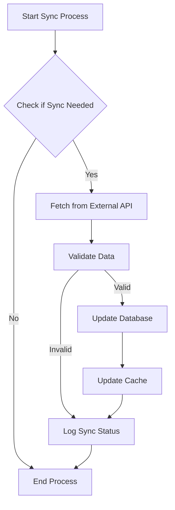
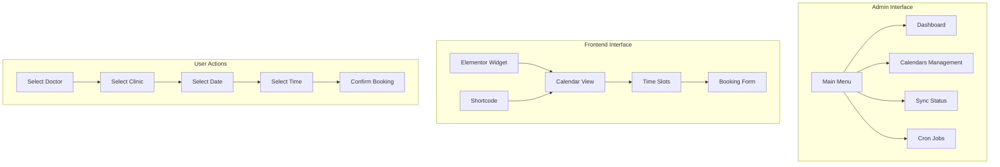
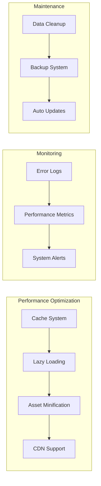
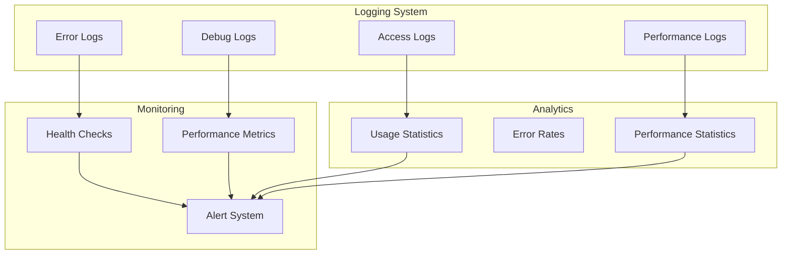

# ארכיטקטורת המערכת - מערכת ניהול תורים למרפאות

## תרשים ארכיטקטורה כללי

## תרשים מבנה בסיס הנתונים

## תרשים זרימת נתונים

## תרשים זרימת סנכרון

## תרשים ממשק משתמש

## תרשים ביצועים ואופטימיזציה

## תרשים אבטחה

```mermaid
graph TD
    subgraph "Security Layers"
        AUTH[Authentication]
        AUTHZ[Authorization]
        VALIDATION[Input Validation]
        SANITIZATION[Data Sanitization]
    end
    
    subgraph "Protection Mechanisms"
        NONCE[Nonce Verification]
        CSRF[CSRF Protection]
        SQL_INJECTION[SQL Injection Prevention]
        XSS[XSS Protection]
    end
    
    subgraph "Access Control"
        USER_ROLES[User Roles]
        PERMISSIONS[Permissions]
        CAPABILITIES[Capabilities]
    end
    
    AUTH --> AUTHZ
    AUTHZ --> VALIDATION
    VALIDATION --> SANITIZATION
    
    NONCE --> CSRF
    CSRF --> SQL_INJECTION
    SQL_INJECTION --> XSS
    
    USER_ROLES --> PERMISSIONS
    PERMISSIONS --> CAPABILITIES
```

## תרשים ניטור ולוגים

## תרשים תחזוקה ועדכונים

```mermaid
graph TD
    subgraph "Maintenance Tasks"
        CLEANUP[Data Cleanup]
        BACKUP[Data Backup]
        OPTIMIZATION[Database Optimization]
        CACHE_CLEAR[Cache Clearing]
    end
    
    subgraph "Update Process"
        VERSION_CHECK[Version Check]
        DEPLOYMENT[Deployment]
        ROLLBACK[Rollback]
        TESTING[Testing]
    end
    
    subgraph "Health Monitoring"
        SYSTEM_HEALTH[System Health]
        PERFORMANCE[Performance Monitoring]
        ERROR_TRACKING[Error Tracking]
    end
    
    CLEANUP --> BACKUP
    BACKUP --> OPTIMIZATION
    OPTIMIZATION --> CACHE_CLEAR
    
    VERSION_CHECK --> TESTING
    TESTING --> DEPLOYMENT
    DEPLOYMENT --> ROLLBACK
    
    SYSTEM_HEALTH --> PERFORMANCE
    PERFORMANCE --> ERROR_TRACKING
```

## סיכום ארכיטקטורה

### 1. שכבות המערכת
- **שכבת כניסה**: נקודת כניסה ראשית וטעינת התוסף
- **שכבת ליבה**: מנהלים מרכזיים של המערכת
- **שכבת API**: ניהול תקשורת עם מערכות חיצוניות
- **שכבת ניהול**: ממשקי ניהול למנהלי המערכת
- **שכבת משתמש**: ממשקי משתמש לזמינות
- **שכבת נתונים**: ניהול בסיס נתונים ו-Cache

### 2. עקרונות ארכיטקטורה
- **מודולריות**: הפרדת אחריות בין רכיבים
- **גמישות**: תמיכה ב-Elementor ו-Shortcode
- **ביצועים**: מערכת Cache ואופטימיזציה
- **אבטחה**: הגנות רב-שכבתיות
- **ניטור**: מעקב אחר ביצועים ושגיאות
- **תחזוקה**: ניקוי אוטומטי ועדכונים

### 3. תכונות מתקדמות
- **Cache חכם**: Cache של 30 דקות עם ניקוי אוטומטי
- **סנכרון אוטומטי**: Cron Jobs לסנכרון תקופתי
- **ניטור ביצועים**: מעקב אחר מדדי ביצועים
- **תמיכה ב-RTL**: תמיכה מלאה בעברית
- **אינטגרציה**: תמיכה ב-Elementor ו-WordPress
- **הרחבה**: אפשרויות הרחבה עתידיות

המערכת מספקת ארכיטקטורה מודולרית וגמישה לניהול תורים במרפאות עם כל התכונות הנדרשות לניהול מקצועי ויעיל.

