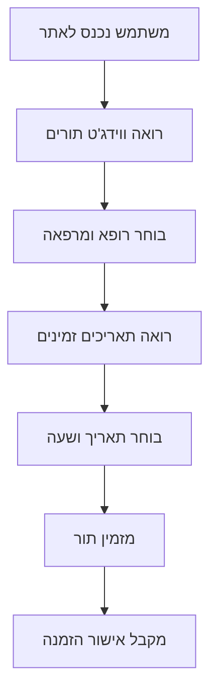
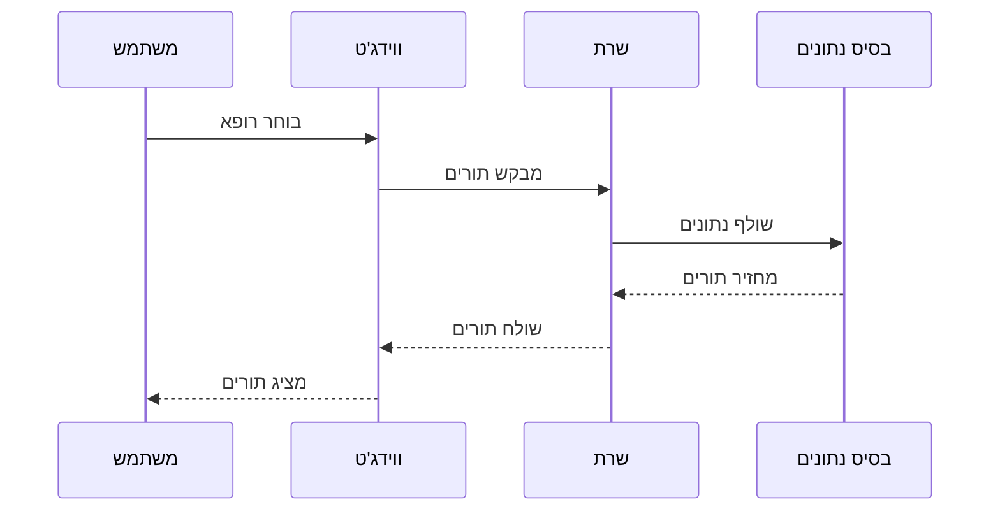
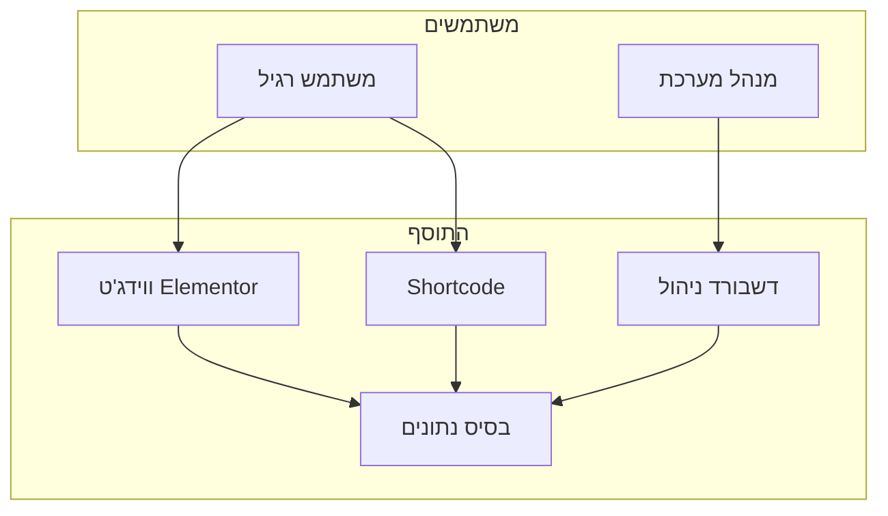
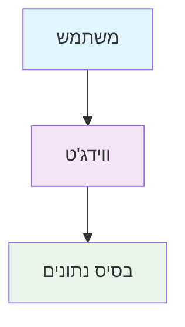
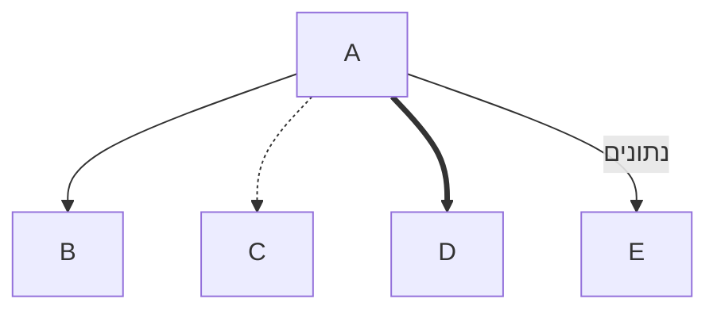
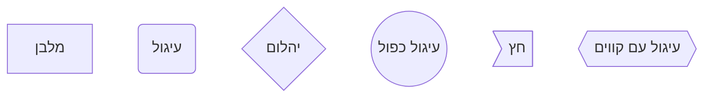

# מדריך הצגת תרשימי זרימה באופן גרפי

## 1. שימוש ב-Mermaid Online Editor

### שלב 1: העתק את הקוד
1. פתח את הקובץ `FLOW_DIAGRAM.md`
2. העתק את הקוד Mermaid (החלק בין ```mermaid ו-```)

### שלב 2: הצג ב-Mermaid Live Editor
1. לך לאתר: https://mermaid.live/
2. הדבק את הקוד Mermaid
3. התרשים יוצג אוטומטית
4. תוכל לייצא כ-PNG, SVG או PDF

## 2. שימוש ב-GitHub

### אם הפרויקט שלך ב-GitHub:
1. העלה את הקבצים ל-GitHub
2. GitHub יציג את תרשימי Mermaid אוטומטית
3. תוכל לראות אותם ישירות ב-GitHub

## 3. שימוש ב-Visual Studio Code

### התקן את התוסף Mermaid Preview:
1. פתח VS Code
2. לך ל-Extensions (Ctrl+Shift+X)
3. חפש "Mermaid Preview"
4. התקן את התוסף
5. פתח את קובץ ה-Markdown
6. לחץ על "Open Preview" (Ctrl+Shift+V)

## 4. שימוש ב-Notion

### אם אתה משתמש ב-Notion:
1. העתק את הקוד Mermaid
2. ב-Notion, השתמש ב-```mermaid
3. הדבק את הקוד
4. Notion יציג את התרשים אוטומטית

## 5. שימוש ב-Obsidian

### אם אתה משתמש ב-Obsidian:
1. התקן את התוסף "Mermaid"
2. פתח את הקובץ
3. התרשים יוצג אוטומטית

## 6. יצירת תמונות

### ייצוא כ-PNG/SVG:
1. ב-Mermaid Live Editor
2. לחץ על "Actions" → "Download PNG"
3. או "Download SVG"

## 7. שימוש ב-Draw.io

### אם אתה רוצה לערוך את התרשימים:
1. לך לאתר: https://app.diagrams.net/
2. צור תרשים חדש
3. העתק את המבנה מהתרשימים שיצרתי
4. ערוך ועצב כרצונך

## 8. שימוש ב-Lucidchart

### אם אתה רוצה תרשימים מקצועיים:
1. לך לאתר: https://lucidchart.com/
2. צור תרשים חדש
3. העתק את המבנה מהתרשימים
4. ערוך ועצב כרצונך

## 9. שימוש ב-Figma

### אם אתה רוצה עיצוב מתקדם:
1. לך לאתר: https://figma.com/
2. צור פרויקט חדש
3. העתק את המבנה מהתרשימים
4. ערוך ועצב כרצונך

## 10. שימוש ב-Canva

### אם אתה רוצה תרשימים יפים:
1. לך לאתר: https://canva.com/
2. חפש "Flowchart" או "Diagram"
3. בחר תבנית
4. ערוך לפי הצורך

## דוגמאות קוד Mermaid להעתקה

### תרשים זרימה פשוט:


### תרשים זרימת נתונים:


### תרשים ארכיטקטורה:


## טיפים להצגה טובה

### 1. השתמש בצבעים:


### 2. השתמש בחצים שונים:


### 3. השתמש בצורות שונות:


## סיכום

הדרך הכי פשוטה היא:
1. **Mermaid Live Editor** - https://mermaid.live/
2. העתק את הקוד מהקבצים שיצרתי
3. הדבק ב-Mermaid Live Editor
4. ייצא כ-PNG או SVG

זה ייתן לך תרשימים מקצועיים ויפים שתוכל להשתמש בהם בתיעוד, מצגות, או כל מטרה אחרת.


